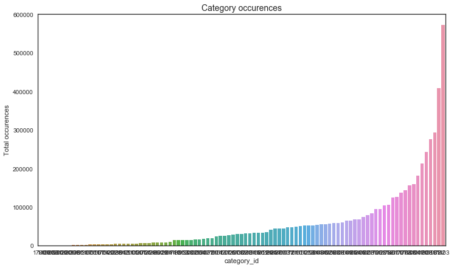

## Summary

This post is an EDA workbook for Outbrain Click Prediction on Kaggle: https://www.kaggle.com/c/outbrain-click-prediction

Currently, Outbrain pairs relevant content with curious readers in about 250 billion personalized recommendations every month across many thousands of sites. In this competition, people are challenged to predict which pieces of content its global base of users are likely to click on. Improving Outbrain’s recommendation algorithm will mean more users uncover stories that satisfy their individual tastes.

Datasets: https://www.kaggle.com/c/outbrain-click-prediction/data
This project has 10+ datasets. In this notebook, I am using pyspark SQL to examine relationships between different datasets, as well as create new variables

Below are some preliminary findings:


### Page view sample table
1. This sample contains 1-day (6/14) pageview data
2. The average pageviews per document is 164 with the maximum of 429,551
3. The average pageviews per user is 1.08 with the maximum of 14
4. There won't be a user viewing the same document more than once


### Events table & Page view sample
1. Timestamp:
    - Events table has data from 6/14 - 6/28
    - Users viewed more ads during 9am - 5pm (12pm was the highest)
    - Users viewed more ads during week days (Monday was the highest) 
2. Ad impressions by document:
    - The average ad impressions per document is 25.8 with the maximum of 319,203
    - 35.72% documents were viewed only once with ads
    - 35.48% documents were viewed more than 5 times with ads
    - 22.19% documents were viewed more than 10 times with ads
    - 13.50% documents were viewed more than 20 times with ads
3. Ad impressions by user:
    - The average ad pageviews per user is 1.16 with the maximum of 49
    - Users from desktop viewed more ads (avg 1.18) than tablet (avg 1.17) and mobile (avg 1.15)
    - 88.42% users viewed ads only once
4. User device
    - 39.05% users came from desktop
    - 47.47% users came from mobile
    - 13.48% users came from tablet
5. Location
    - 19% users were from outside US
    - 10% users were from CA
    - 7% users were from TX
    - 4% users were from FL
    - 4% users were from NY
6. By joining the two tables, we're able to calculate ad display rate on 6/14 
    - In general 1.29% of total impressions were associated with ads. 
    - Tablet had a higher ad display rate (1.75%) than desktop (1.39%) and mobile (1.11%)


### Document tables
1. Category
    - 97 categories
    - There were 8 categories that only appeared in less than 10 documents
    - 90.722% of categories appeared in more than 1000 documents
    - 67.010% of categories appeared in more than 10000 documents
2. Topic
    - 300 topics
    - 84.333% of topics appeared in more than 5000 documents
    - 67.000% of topics appeared in more than 10000 documents


### Train and test tables
1. Train table
    - 22.69% ads appeared once
    - 49.32% ads appeared more than 5 times
    - 36.24% ads appeared more than 10 times
2. 82.87% ads in test dataset appeared in training dataset


```python
import numpy as np
import pandas as pd
import matplotlib.pyplot as plt
import datetime

import seaborn as sns
plt.style.use('seaborn-white')
%matplotlib inline
```


```python
pro=pd.read_csv("datasets/promoted_content.csv")
```

## page_views (sample)


```python
# read page_views in pyspark
df_page_views = spark.read.csv(
    path        =   "datasets/page_views_sample.csv",
    header      =   True, 
    mode        =   "DROPMALFORMED",   # Poorly formed rows in CSV are dropped rather than erroring entire operation
    inferSchema =   True               # Not always perfect but works well in most cases as of 2.1+
)
```


```python
df_page_views.printSchema()
```

    root
     |-- uuid: string (nullable = true)
     |-- document_id: integer (nullable = true)
     |-- timestamp: integer (nullable = true)
     |-- platform: integer (nullable = true)
     |-- geo_location: string (nullable = true)
     |-- traffic_source: integer (nullable = true)
    


```python
df_page_views.show(n=5)
```

    +--------------+-----------+---------+--------+------------+--------------+
    |          uuid|document_id|timestamp|platform|geo_location|traffic_source|
    +--------------+-----------+---------+--------+------------+--------------+
    |1fd5f051fba643|        120| 31905835|       1|          RS|             2|
    |8557aa9004be3b|        120| 32053104|       1|       VN>44|             2|
    |c351b277a358f0|        120| 54013023|       1|       KR>12|             1|
    |8205775c5387f9|        120| 44196592|       1|       IN>16|             2|
    |9cb0ccd8458371|        120| 65817371|       1|   US>CA>807|             2|
    +--------------+-----------+---------+--------+------------+--------------+
    only showing top 5 rows
    


```python
df_page_views.describe().show()
```

    +-------+--------------+------------------+-------------------+------------------+------------+------------------+
    |summary|          uuid|       document_id|          timestamp|          platform|geo_location|    traffic_source|
    +-------+--------------+------------------+-------------------+------------------+------------+------------------+
    |  count|       9999999|           9999999|            9999999|           9999999|     9999999|           9999999|
    |   mean|      Infinity|1336961.4931401494|4.915974918146362E7|1.6514509651450966|        null| 1.499490649949065|
    | stddev|           NaN| 639103.5676637741|2.215445190218439E7|0.6408070416101002|        null|0.7633959864429678|
    |    min|100000e3a78374|                17|                 12|                 1|          --|                 1|
    |    max|ffffffdee25725|           1893691|           86399982|                 3|       ZW>07|                 3|
    +-------+--------------+------------------+-------------------+------------------+------------+------------------+
    


```python
df_page_views.dtypes
```


    [('uuid', 'string'),
     ('document_id', 'int'),
     ('timestamp', 'int'),
     ('platform', 'int'),
     ('geo_location', 'string'),
     ('traffic_source', 'int')]


```python
df_page_views.select('timestamp').describe().show()
```

    +-------+-------------------+
    |summary|          timestamp|
    +-------+-------------------+
    |  count|            9999999|
    |   mean|4.915974918146362E7|
    | stddev|2.215445190218439E7|
    |    min|                 12|
    |    max|           86399982|
    +-------+-------------------+
    


#### The sample has page view data from 6/14 only


```python
# Page view sample data is from 6/14 only
max_timestamp = (86399982 + 1465876799998)/1000.0
min_timestamp = (12 ++ 1465876799998)/1000.0

print 'start time:', datetime.datetime.fromtimestamp(min_timestamp).strftime('%Y-%m-%d %H:%M:%S.%f')
print 'end time:', datetime.datetime.fromtimestamp(max_timestamp).strftime('%Y-%m-%d %H:%M:%S.%f')
```

    start time: 2016-06-14 00:00:00.010000
    end time: 2016-06-14 23:59:59.980000


#### Use Spark SQL


```python
df_page_views.createOrReplaceTempView("temp_df_page_views")
```


```python
# impressions by document_id
spark.sql('Create Table df_pv_by_doc AS (SELECT document_id, count(uuid) as impressions \
FROM temp_df_page_views Group by document_id Order by impressions DESC)').show(5)
```


```python
spark.sql('Select * from df_pv_by_doc').show(5)
```

    +-----------+-----------+
    |document_id|impressions|
    +-----------+-----------+
    |    1811567|     429551|
    |        234|     179692|
    |      42744|     156231|
    |    1858440|     112140|
    |    1780813|     109624|
    +-----------+-----------+
    only showing top 5 rows
    


```python
spark.sql('Select avg(impressions) FROM df_pv_by_doc').show()
```

    +------------------+
    |  avg(impressions)|
    +------------------+
    |167.08715266754666|
    +------------------+
    


```python
# impressions by user 
spark.sql('Create Table df_pv_by_uuid AS (SELECT uuid, count(document_id) as impressions, \
    platform FROM temp_df_page_views Group by uuid, platform Order by impressions DESC)').show(5)
```


```python
spark.sql('Select * from df_pv_by_uuid').show(5)
```

    +--------------+-----------+--------+
    |          uuid|impressions|platform|
    +--------------+-----------+--------+
    |eb084115822194|         14|       1|
    |cd9cae9aba060c|         12|       1|
    |72ca9f72e0c5e4|         12|       2|
    |240485be779bc2|         11|       1|
    |86402f4b23836b|         11|       1|
    +--------------+-----------+--------+
    only showing top 5 rows
    


```python
spark.sql('Select avg(impressions), platform FROM df_pv_by_uuid group by platform').show()
```

    +------------------+--------+
    |  avg(impressions)|platform|
    +------------------+--------+
    |1.1181479760390243|       1|
    |1.0792275836768672|       3|
    |1.0600248127601748|       2|
    +------------------+--------+
    


```python
spark.sql('Select avg(impressions)FROM df_pv_by_uuid').show()
```

    +------------------+
    |  avg(impressions)|
    +------------------+
    |1.0866726969762894|
    +------------------+
    


```python
# Does an user view same document more than once within same day? - No
spark.sql('SELECT uuid, document_id, count(timestamp) FROM temp_df_page_views Group by uuid, document_id Order by count(timestamp) DESC').show(5)
```

    +--------------+-----------+----------------+
    |          uuid|document_id|count(timestamp)|
    +--------------+-----------+----------------+
    |5e77adbaadcc76|       2258|               1|
    |98d5e2c4ae9848|       7012|               1|
    |7d2ef9b2817da6|       7012|               1|
    |1416bff7e93ceb|       7012|               1|
    |301ab011f97440|       7012|               1|
    +--------------+-----------+----------------+
    only showing top 5 rows
    


```python
df_page_views_pd = pd.read_csv("datasets/page_views_sample.csv")
```


```python
# engagement level (pageviews per day by user)
page_views_per_user = df_page_views_pd.groupby(['uuid'])['document_id'].count()
```


```python
# documents popularity (average daily impressions)
page_views_per_doc = df_page_views_pd.groupby(['document_id'])['uuid'].count()
```

## Events

### 1. Load data


```python
# read events in pyspark
df_events = spark.read.csv(
    path        =   "datasets/events.csv",
    header      =   True, 
    mode        =   "DROPMALFORMED",   # Poorly formed rows in CSV are dropped rather than erroring entire operation
    inferSchema =   True               # Not always perfect but works well in most cases as of 2.1+
)
```


```python
df_events.show(n=5)
```

    +----------+--------------+-----------+---------+--------+------------+
    |display_id|          uuid|document_id|timestamp|platform|geo_location|
    +----------+--------------+-----------+---------+--------+------------+
    |         1|cb8c55702adb93|     379743|       61|       3|   US>SC>519|
    |         2|79a85fa78311b9|    1794259|       81|       2|   US>CA>807|
    |         3|822932ce3d8757|    1179111|      182|       2|   US>MI>505|
    |         4|85281d0a49f7ac|    1777797|      234|       2|   US>WV>564|
    |         5|8d0daef4bf5b56|     252458|      338|       2|       SG>00|
    +----------+--------------+-----------+---------+--------+------------+
    only showing top 5 rows
    


```python
df_events.select('timestamp').describe().show()
```

    +-------+-------------------+
    |summary|          timestamp|
    +-------+-------------------+
    |  count|           23120126|
    |   mean|6.540050394022858E8|
    | stddev|3.770035880180587E8|
    |    min|                 61|
    |    max|         1295999805|
    +-------+-------------------+
    


```python
df_events.dtypes
```


    [('display_id', 'int'),
     ('uuid', 'string'),
     ('document_id', 'int'),
     ('timestamp', 'int'),
     ('platform', 'string'),
     ('geo_location', 'string')]


```python
df_events_pd = pd.read_csv("datasets/events.csv")
```

### 2. Timestamp


```python
# events data is from 6/14 - 6/28
max_timestamp = (1295999805 + 1465876799998)/1000.0
min_timestamp = (61 ++ 1465876799998)/1000.0

print 'start time:', datetime.datetime.fromtimestamp(min_timestamp).strftime('%Y-%m-%d %H:%M:%S.%f')
print 'end time:', datetime.datetime.fromtimestamp(max_timestamp).strftime('%Y-%m-%d %H:%M:%S.%f')
```

    start time: 2016-06-14 00:00:00.059000
    end time: 2016-06-28 23:59:59.803000


```python
# What time do people view ads most (by hour)
df_events_pd['datetime'] = df_events_pd.timestamp.apply(lambda x: datetime.datetime.fromtimestamp((x+1465876799998)/1000.0).\
                             strftime('%Y-%m-%d %H:%M:%S.%f'))
```


```python
df_events_pd['hour'] = df_events_pd['datetime'].apply(lambda x: x[11:13])
```


```python
df_events_pd['day'] = df_events_pd['datetime'].apply(lambda x: x[:10])
```


```python
hour_table = df_events_pd.groupby(['hour'])['display_id'].count()
```


```python
day_table = df_events_pd.groupby(['day'])['display_id'].count()
```


```python
objects = hour_table.index
y_pos = np.arange(len(objects))

fig, ax = plt.subplots(figsize=(16,7))
plt.bar(y_pos, hour_table, align='center', alpha=0.5)
plt.xticks(y_pos, objects)
plt.ylabel('Ads impressions')
plt.title('Number of ads viewed by hour', fontsize=14);
```


```python
# What date do people viewed ads most (by day)
objects = day_table.index
y_pos = np.arange(len(objects))

fig, ax = plt.subplots(figsize=(16,7))
plt.bar(y_pos, day_table, align='center', alpha=0.5)
plt.xticks(y_pos, objects)
plt.ylabel('Ads impressions')
plt.title('Number of ads viewed by date', fontsize=14);
```


```python
day_df_table = pd.DataFrame(day_table)
day_df_table.index = pd.DatetimeIndex(day_df_table.index)
```


```python
day_df_table['dayofweek']=day_df_table.index.dayofweek
```


```python
dayofweek_df_table = day_df_table.groupby(['dayofweek']).mean()
```


```python
# What day of week do people viewed ads most (by day)
objects = ['Mon','Tue','Wed','Thu','Fri','Sat','Sun']
y_pos = np.arange(len(objects))

fig, ax = plt.subplots(figsize=(12,7))
plt.bar(y_pos, dayofweek_df_table['display_id'], align='center', alpha=0.5)
plt.xticks(y_pos, objects)
plt.ylabel('Ads impressions')
plt.title('Number of ads viewed by day', fontsize=14);
```


### 3. Impressions by document


```python
df_events.createOrReplaceTempView("temp_df_events")
```


```python
# number of display per document
spark.sql('Create table df_events_per_doc AS (SELECT document_id, count(display_id) as ad_impr \
        FROM temp_df_events Group by document_id Order by ad_impr DESC)').show(5)
```


```python
spark.sql('Select * from df_events_per_doc').show(5)
```

    +-----------+-------+
    |document_id|ad_impr|
    +-----------+-------+
    |    1179111| 319203|
    |     394689| 208574|
    |    1827718| 195070|
    |      38922|  86380|
    |    1788295|  68509|
    +-----------+-------+
    only showing top 5 rows
    


```python
spark.sql('Select avg(ad_impr) from df_events_per_doc').show(5)
```

    +------------------+
    |      avg(ad_impr)|
    +------------------+
    |25.859702928215107|
    +------------------+
    


```python
# % of documents viewed
df_events_pd_document_table = df_events_pd.groupby(['document_id']).count().groupby(['display_id']).count()
```


```python
total_documents = df_events_pd_document_table.uuid.sum()
df_events_pd_document_table_percentage = df_events_pd_document_table.uuid.apply(lambda x: x/float(total_documents)*100)

print '-- {:.2f}% documents were viewed once with ads'.format(df_events_pd_document_table_percentage.iloc[0])
for i in [5, 10, 20, 100,1000,10000]:
    print '-- {:.2f}% documents were viewed more than {} times with ads'.format(df_events_pd_document_table_percentage.loc[i:].sum(),i)
```

    -- 35.72% documents were viewed once with ads
    -- 35.48% documents were viewed more than 5 times with ads
    -- 22.19% documents were viewed more than 10 times with ads
    -- 13.50% documents were viewed more than 20 times with ads
    -- 3.56% documents were viewed more than 100 times with ads
    -- 0.30% documents were viewed more than 1000 times with ads
    -- 0.01% documents were viewed more than 10000 times with ads


### 4. Impressions by user


```python
# number of display viewed per user (which platform)
spark.sql('Create table df_events_per_uuid AS (SELECT uuid, count(display_id) as ad_impr, \
platform FROM temp_df_events Group by uuid, platform Order by ad_impr DESC)').show(5)
```


```python
spark.sql('Select * from df_events_per_uuid').show(5)
```

    +--------------+-------+--------+
    |          uuid|ad_impr|platform|
    +--------------+-------+--------+
    |b88553e3a2aa29|     49|       2|
    |2759b057797f02|     46|       2|
    |c0bd502c7a479f|     42|       2|
    |45d23867dbe3b3|     38|       2|
    |ef7761dd22277c|     38|       2|
    +--------------+-------+--------+
    only showing top 5 rows
    


```python
spark.sql('Select avg(ad_impr) from df_events_per_uuid').show(5)
```

    +------------------+
    |      avg(ad_impr)|
    +------------------+
    |1.1679054462437826|
    +------------------+
    


```python
spark.sql('Select avg(ad_impr),platform from df_events_per_uuid group by platform').show(5)
```

    +------------------+--------+
    |      avg(ad_impr)|platform|
    +------------------+--------+
    | 1.173646996266563|       3|
    |               1.0|    null|
    |1.1860993337570247|       1|
    |1.1517754111621799|       2|
    +------------------+--------+
    


```python
# % of users who viewed ads more than once
df_events_pd_user_table = df_events_pd.groupby(['uuid']).count().groupby(['display_id']).count()
```


```python
total_users = df_events_pd_user_table.document_id.sum()
df_events_pd_user_table_percentage = df_events_pd_user_table.document_id.apply(lambda x: x/float(total_users)*100)

print '-- {:.2f}% users viewed ads only once'.format(df_events_pd_user_table_percentage.iloc[0])
print '-- {:.2f}% users viewed ads twice'.format(df_events_pd_user_table_percentage.iloc[1])
print '-- {:.2f}% users viewed ads three times'.format(df_events_pd_user_table_percentage.iloc[2])
print '-- {:.2f}% users viewed ads four times'.format(df_events_pd_user_table_percentage.iloc[3])
print '-- {:.2f}% users viewed ads more than five times'.format(df_events_pd_user_table_percentage.iloc[4:].sum())
```

    -- 88.42% users viewed ads only once
    -- 8.60% users viewed ads twice
    -- 1.90% users viewed ads three times
    -- 0.60% users viewed ads four times
    -- 0.49% users viewed ads more than five times


### 5. User device


```python
df_events_pd.platform.unique()
```


    array(['3', '2', '1', '\\N'], dtype=object)


```python
df_events_pd.platform = df_events_pd.platform.astype(str)
```


```python
# plot user by platform
df_events_platform_table = df_events_pd.pivot_table(index='platform',values='uuid', aggfunc=[len])
```


```python
# 1 = desktop, 2 = mobile, 3 = tablet
objects = ('desktop', 'mobile', 'tablet', 'NA')
y_pos = np.arange(len(objects))

fig, ax = plt.subplots(figsize=(12,7))
plt.bar(y_pos, df_events_platform_table.len, align='center', alpha=0.5)
plt.xticks(y_pos, objects)
plt.ylabel('Number of users')
plt.title('Number of users by platform', fontsize=14)

rects = ax.patches
values = df_events_platform_table.len.tolist()

for rect, value in zip(rects, values):
    height = rect.get_height()
    ax.text(rect.get_x() + rect.get_width()/2, height+5, value, ha='center', va='bottom')

platform_list =['desktop','mobile','tablet']
for i in range(3):
    platform = df_events_platform_table.len[i] / float(df_events_platform_table.len.sum()) * 100
    print '-- {:.2f}% users came from {}'.format(platform,platform_list[i]) 
```

    -- 39.05% users came from desktop
    -- 47.47% users came from mobile
    -- 13.48% users came from tablet


```python
# relationship between events and page_views on 6/14
# left join page_view sample and events on uuid, document, time

spark.sql('Create Table df_events_pv AS (SELECT e.display_id, pv.uuid, pv.document_id, \
    pv.timestamp, pv.platform, pv.geo_location, \
    pv.traffic_source FROM temp_df_page_views as pv left join temp_df_events as e \
    on pv.uuid = e.uuid and pv.document_id = e.document_id)').show(5)
```


```python
# first 5 rows from the new joined table
spark.sql('select * from df_events_pv limit 5').show()
```

    +----------+--------------+-----------+---------+--------+------------+--------------+
    |display_id|          uuid|document_id|timestamp|platform|geo_location|traffic_source|
    +----------+--------------+-----------+---------+--------+------------+--------------+
    |      null|1000dc3f6a76c4|    1528733|  9451854|       2|       ZA>11|             1|
    |      null|100212ee58431f|    1844981| 53400263|       1|   US>MI>563|             2|
    |      null|10031b41dfb68f|    1815256| 32680250|       2|   US>IN>582|             1|
    |      null|10045673acc2fb|    1786769|  4662714|       2|   US>OR>820|             3|
    |      null|1005181847a1f9|    1758965|  8539642|       2|   US>CA>803|             1|
    +----------+--------------+-----------+---------+--------+------------+--------------+
    


```python
# display rate on 6/14 - 1.29% (number of display_id / number of uuid)
spark.sql('SELECT count(display_id) / count(uuid) from df_events_pv').show()
```

    +-----------------------------------------------------------------+
    |(CAST(count(display_id) AS DOUBLE) / CAST(count(uuid) AS DOUBLE))|
    +-----------------------------------------------------------------+
    |                                             0.012964149487121787|
    +-----------------------------------------------------------------+
    


```python
# display rate on 6/14 by platform - 3 (tablet) has the highest display rate, 1 (desktop) is
# the second, 2 (mobile) is the last one
spark.sql('SELECT count(display_id) / count(uuid), platform from df_events_pv \
        group by platform').show()
```

    +-----------------------------------------------------------------+--------+
    |(CAST(count(display_id) AS DOUBLE) / CAST(count(uuid) AS DOUBLE))|platform|
    +-----------------------------------------------------------------+--------+
    |                                              0.01396078659078594|       1|
    |                                             0.017562003714453055|       3|
    |                                             0.011122813337803399|       2|
    +-----------------------------------------------------------------+--------+
    


### 6. Location


```python
df_events_pd['country'] = df_events_pd.geo_location.astype('str').apply(lambda x: x[0:2])
```


```python
def extract_state(x):
    if str(x)[0:2] == 'US':
        try:
            y = str(x)[3:5]
        except:
            y = np.nan
    else:
        y = 'Outside US'
    return y
```


```python
df_events_pd['state'] = df_events_pd.geo_location.apply(lambda x: extract_state(x))
```


```python
df_location_table = df_events_pd.groupby(['state'])['document_id'].count()
```


```python
df_location_table =df_location_table.sort_values(ascending=False)
```


```python
df_location_table = pd.DataFrame(df_location_table)
df_location_table
```


<div>
<table border="1" class="dataframe">
  <thead>
    <tr style="text-align: right;">
      <th></th>
      <th>document_id</th>
    </tr>
    <tr>
      <th>state</th>
      <th></th>
    </tr>
  </thead>
  <tbody>
    <tr>
      <th>Outside US</th>
      <td>4524674</td>
    </tr>
    <tr>
      <th>CA</th>
      <td>2395278</td>
    </tr>
    <tr>
      <th>TX</th>
      <td>1645323</td>
    </tr>
    <tr>
      <th>FL</th>
      <td>1128279</td>
    </tr>
    <tr>
      <th>NY</th>
      <td>1105926</td>
    </tr>
    <tr>
      <th>PA</th>
      <td>784612</td>
    </tr>
    <tr>
      <th></th>
      <td>758487</td>
    </tr>
    <tr>
      <th>IL</th>
      <td>745661</td>
    </tr>
    <tr>
      <th>OH</th>
      <td>633699</td>
    </tr>
    <tr>
      <th>MI</th>
      <td>623564</td>
    </tr>
    <tr>
      <th>NC</th>
      <td>597003</td>
    </tr>
    <tr>
      <th>NJ</th>
      <td>537440</td>
    </tr>
    <tr>
      <th>GA</th>
      <td>528729</td>
    </tr>
    <tr>
      <th>VA</th>
      <td>520956</td>
    </tr>
    <tr>
      <th>WA</th>
      <td>432731</td>
    </tr>
    <tr>
      <th>MA</th>
      <td>423000</td>
    </tr>
    <tr>
      <th>AZ</th>
      <td>378966</td>
    </tr>
    <tr>
      <th>MD</th>
      <td>359724</td>
    </tr>
    <tr>
      <th>CO</th>
      <td>345236</td>
    </tr>
    <tr>
      <th>MN</th>
      <td>311927</td>
    </tr>
    <tr>
      <th>TN</th>
      <td>303689</td>
    </tr>
    <tr>
      <th>WI</th>
      <td>291747</td>
    </tr>
    <tr>
      <th>MO</th>
      <td>290877</td>
    </tr>
    <tr>
      <th>IN</th>
      <td>266973</td>
    </tr>
    <tr>
      <th>OR</th>
      <td>260209</td>
    </tr>
    <tr>
      <th>CT</th>
      <td>219261</td>
    </tr>
    <tr>
      <th>AL</th>
      <td>213932</td>
    </tr>
    <tr>
      <th>SC</th>
      <td>206991</td>
    </tr>
    <tr>
      <th>KY</th>
      <td>182070</td>
    </tr>
    <tr>
      <th>LA</th>
      <td>181903</td>
    </tr>
    <tr>
      <th>OK</th>
      <td>150365</td>
    </tr>
    <tr>
      <th>IA</th>
      <td>143605</td>
    </tr>
    <tr>
      <th>KS</th>
      <td>142806</td>
    </tr>
    <tr>
      <th>UT</th>
      <td>139593</td>
    </tr>
    <tr>
      <th>NV</th>
      <td>138275</td>
    </tr>
    <tr>
      <th>MS</th>
      <td>107735</td>
    </tr>
    <tr>
      <th>DC</th>
      <td>106562</td>
    </tr>
    <tr>
      <th>NE</th>
      <td>106380</td>
    </tr>
    <tr>
      <th>AR</th>
      <td>101745</td>
    </tr>
    <tr>
      <th>NM</th>
      <td>92545</td>
    </tr>
    <tr>
      <th>HI</th>
      <td>82223</td>
    </tr>
    <tr>
      <th>NH</th>
      <td>71553</td>
    </tr>
    <tr>
      <th>DE</th>
      <td>70580</td>
    </tr>
    <tr>
      <th>WV</th>
      <td>69734</td>
    </tr>
    <tr>
      <th>ID</th>
      <td>69638</td>
    </tr>
    <tr>
      <th>ME</th>
      <td>62438</td>
    </tr>
    <tr>
      <th>RI</th>
      <td>49204</td>
    </tr>
    <tr>
      <th>MT</th>
      <td>42716</td>
    </tr>
    <tr>
      <th>AK</th>
      <td>38516</td>
    </tr>
    <tr>
      <th>SD</th>
      <td>36643</td>
    </tr>
    <tr>
      <th>ND</th>
      <td>34799</td>
    </tr>
    <tr>
      <th>VT</th>
      <td>28466</td>
    </tr>
    <tr>
      <th>WY</th>
      <td>24841</td>
    </tr>
    <tr>
      <th>AE</th>
      <td>7092</td>
    </tr>
    <tr>
      <th>AP</th>
      <td>3141</td>
    </tr>
    <tr>
      <th>AA</th>
      <td>64</td>
    </tr>
  </tbody>
</table>
</div>


```python
total_item = float(df_location_table.document_id.sum())
```


```python
df_location_table['percentage'] = df_location_table.document_id.map(lambda x: x/total_item*100)
```


```python
df_location_table.head()
```


<div>
<table border="1" class="dataframe">
  <thead>
    <tr style="text-align: right;">
      <th></th>
      <th>document_id</th>
      <th>percentage</th>
    </tr>
    <tr>
      <th>state</th>
      <th></th>
      <th></th>
    </tr>
  </thead>
  <tbody>
    <tr>
      <th>Outside US</th>
      <td>4524674</td>
      <td>19.570283</td>
    </tr>
    <tr>
      <th>CA</th>
      <td>2395278</td>
      <td>10.360143</td>
    </tr>
    <tr>
      <th>TX</th>
      <td>1645323</td>
      <td>7.116410</td>
    </tr>
    <tr>
      <th>FL</th>
      <td>1128279</td>
      <td>4.880073</td>
    </tr>
    <tr>
      <th>NY</th>
      <td>1105926</td>
      <td>4.783391</td>
    </tr>
  </tbody>
</table>
</div>


```python
fig,ax = plt.subplots(figsize=(15, 7))
sns.barplot(df_location_table.index, df_location_table.values, order=df_location_table.index, alpha=1)
plt.ylabel('Total impressions')
plt.title('Ad Impression by location', fontsize=14);
```


## Documents


```python
# read categories in pyspark
df_categories = spark.read.csv(
    path        =   "datasets/documents_categories.csv",
    header      =   True, 
    mode        =   "DROPMALFORMED",   # Poorly formed rows in CSV are dropped rather than erroring entire operation
    inferSchema =   True               # Not always perfect but works well in most cases as of 2.1+
)
```


```python
# read entities in pyspark
df_entities = spark.read.csv(
    path        =   "datasets/documents_entities.csv",
    header      =   True, 
    mode        =   "DROPMALFORMED",   # Poorly formed rows in CSV are dropped rather than erroring entire operation
    inferSchema =   True               # Not always perfect but works well in most cases as of 2.1+
)
```


```python
# read meta in pyspark
df_meta = spark.read.csv(
    path        =   "datasets/documents_meta.csv",
    header      =   True, 
    mode        =   "DROPMALFORMED",   # Poorly formed rows in CSV are dropped rather than erroring entire operation
    inferSchema =   True               # Not always perfect but works well in most cases as of 2.1+
)
```


```python
# read topics in pyspark
df_topics = spark.read.csv(
    path        =   "datasets/documents_topics.csv",
    header      =   True, 
    mode        =   "DROPMALFORMED",   # Poorly formed rows in CSV are dropped rather than erroring entire operation
    inferSchema =   True               # Not always perfect but works well in most cases as of 2.1+
)
```


```python
df_categories_pd = pd.read_csv("datasets/documents_categories.csv")
```


```python
df_entities_pd = pd.read_csv("datasets/documents_entities.csv")
```


```python
df_meta_pd = pd.read_csv("datasets/documents_meta.csv")
```


```python
df_topics_pd = pd.read_csv("datasets/documents_topics.csv")
```

### 1. Categories


```python
df_categories_pd.head()
```


<div>
<table border="1" class="dataframe">
  <thead>
    <tr style="text-align: right;">
      <th></th>
      <th>document_id</th>
      <th>category_id</th>
      <th>confidence_level</th>
    </tr>
  </thead>
  <tbody>
    <tr>
      <th>0</th>
      <td>1595802</td>
      <td>1611</td>
      <td>0.92</td>
    </tr>
    <tr>
      <th>1</th>
      <td>1595802</td>
      <td>1610</td>
      <td>0.07</td>
    </tr>
    <tr>
      <th>2</th>
      <td>1524246</td>
      <td>1807</td>
      <td>0.92</td>
    </tr>
    <tr>
      <th>3</th>
      <td>1524246</td>
      <td>1608</td>
      <td>0.07</td>
    </tr>
    <tr>
      <th>4</th>
      <td>1617787</td>
      <td>1807</td>
      <td>0.92</td>
    </tr>
  </tbody>
</table>
</div>


```python
len(df_categories_pd.category_id.unique())
```


    97


```python
categories_table = df_categories_pd.groupby(['category_id'])['document_id'].count()
```


```python
categories_table = categories_table.sort_values()
```


```python
categories_table[categories_table>1000].sum()
```


    5480969


```python
fig,ax = plt.subplots(figsize=(12, 7))
sns.barplot(categories_table.index, categories_table.values, order=categories_table.index, alpha=1)
plt.ylabel('Total occurences')
plt.title('Category occurences', fontsize=14);

total_num = float(len(df_categories_pd.category_id.unique()))
for i in [10, 1000, 10000, 50000, 100000,500000]:
    print '-- {:.3f}% of categories appeared in more than {} documents'.format(categories_table[categories_table>i].count() / total_num *100,i)
```

    -- 91.753% of categories appeared in more than 10 documents
    -- 90.722% of categories appeared in more than 1000 documents
    -- 67.010% of categories appeared in more than 10000 documents
    -- 36.082% of categories appeared in more than 50000 documents
    -- 15.464% of categories appeared in more than 100000 documents
    -- 1.031% of categories appeared in more than 500000 documents





### 2. Topics


```python
df_topics_pd.head()
```


<div>
<table border="1" class="dataframe">
  <thead>
    <tr style="text-align: right;">
      <th></th>
      <th>document_id</th>
      <th>topic_id</th>
      <th>confidence_level</th>
    </tr>
  </thead>
  <tbody>
    <tr>
      <th>0</th>
      <td>1595802</td>
      <td>140</td>
      <td>0.073113</td>
    </tr>
    <tr>
      <th>1</th>
      <td>1595802</td>
      <td>16</td>
      <td>0.059416</td>
    </tr>
    <tr>
      <th>2</th>
      <td>1595802</td>
      <td>143</td>
      <td>0.045421</td>
    </tr>
    <tr>
      <th>3</th>
      <td>1595802</td>
      <td>170</td>
      <td>0.038867</td>
    </tr>
    <tr>
      <th>4</th>
      <td>1524246</td>
      <td>113</td>
      <td>0.196450</td>
    </tr>
  </tbody>
</table>
</div>


```python
len(df_topics_pd.topic_id.unique())
```


    300


```python
topics_table = df_topics_pd.groupby(['topic_id'])['document_id'].count()
```


```python
topics_table = topics_table.sort_values()
```


```python
topics_table
```


    topic_id
    293      1717
    122      1839
    123      1866
    288      1883
    251      1929
    34       2008
    40       2094
    88       2450
    99       2477
    245      2492
    195      2574
    14       2584
    218      2638
    171      2694
    273      2799
    169      2817
    236      2866
    59       2959
    31       3017
    76       3091
    28       3107
    50       3238
    158      3281
    212      3304
    188      3307
    114      3328
    7        3378
    253      3498
    278      3636
    272      3704
            ...  
    260     91576
    26      91760
    294     92037
    74      92482
    252     95091
    254     95615
    97      98549
    92      98563
    265    101952
    249    102675
    25     105219
    24     106559
    43     111586
    258    120182
    153    121627
    160    121968
    231    122104
    216    123496
    136    124320
    173    135951
    8      139734
    49     154783
    235    156856
    107    157643
    181    177946
    143    181260
    140    195645
    20     226877
    184    256028
    16     268216
    Name: document_id, dtype: int64


```python
total_num_2 = float(300)
for i in [5000, 10000, 50000,100000,200000]:
    print '-- {:.3f}% of topics appeared in more than {} documents'.format(topics_table[topics_table>i].count() / total_num_2 *100,i)
    
    
fig,ax = plt.subplots(figsize=(12, 7))
sns.barplot(topics_table.index, topics_table.values, order=topics_table.index, alpha=1)
plt.ylabel('Total occurences')
plt.title('Topic occurences', fontsize=14);
```

    -- 84.333% of topics appeared in more than 5000 documents
    -- 67.000% of topics appeared in more than 10000 documents
    -- 28.667% of topics appeared in more than 50000 documents
    -- 7.333% of topics appeared in more than 100000 documents
    -- 1.000% of topics appeared in more than 200000 documents


### 3. Bucket confidence level


```python
bin = np.arange(0,1.1,0.1)
group_name = np.arange(1,11)
df_categories_pd['c_level'] = pd.cut(df_categories_pd.confidence_level,bin,labels=group_name)
df_topics_pd['c_level'] = pd.cut(df_topics_pd.confidence_level,bin,labels=group_name)
```

### Train and Test data


```python
# read content in pyspark
df_content = spark.read.csv(
    path        =   "datasets/promoted_content.csv",
    header      =   True, 
    mode        =   "DROPMALFORMED",   # Poorly formed rows in CSV are dropped rather than erroring entire operation
    inferSchema =   True               # Not always perfect but works well in most cases as of 2.1+
)
```


```python
# read content in pyspark
df_train = spark.read.csv(
    path        =   "datasets/clicks_train.csv",
    header      =   True, 
    mode        =   "DROPMALFORMED",   # Poorly formed rows in CSV are dropped rather than erroring entire operation
    inferSchema =   True               # Not always perfect but works well in most cases as of 2.1+
)
```


```python
# read content in pyspark
df_test = spark.read.csv(
    path        =   "datasets/clicks_test.csv",
    header      =   True, 
    mode        =   "DROPMALFORMED",   # Poorly formed rows in CSV are dropped rather than erroring entire operation
    inferSchema =   True               # Not always perfect but works well in most cases as of 2.1+
)
```


```python
df_train_pd = pd.read_csv("datasets/clicks_train.csv")
```


```python
df_test_pd = pd.read_csv("datasets/clicks_test.csv")
```


```python
df_test_pd.head()
```


<div>
<table border="1" class="dataframe">
  <thead>
    <tr style="text-align: right;">
      <th></th>
      <th>display_id</th>
      <th>ad_id</th>
    </tr>
  </thead>
  <tbody>
    <tr>
      <th>0</th>
      <td>16874594</td>
      <td>66758</td>
    </tr>
    <tr>
      <th>1</th>
      <td>16874594</td>
      <td>150083</td>
    </tr>
    <tr>
      <th>2</th>
      <td>16874594</td>
      <td>162754</td>
    </tr>
    <tr>
      <th>3</th>
      <td>16874594</td>
      <td>170392</td>
    </tr>
    <tr>
      <th>4</th>
      <td>16874594</td>
      <td>172888</td>
    </tr>
  </tbody>
</table>
</div>


```python
# Ads occurences
df_train_table = df_train_pd.groupby(['ad_id'])['display_id'].count()
```


```python
df_train_table.sort_values()
```


    ad_id
    268955         1
    230025         1
    230029         1
    230031         1
    230032         1
    230038         1
    230039         1
    230041         1
    230045         1
    230023         1
    230046         1
    230052         1
    230057         1
    230059         1
    230061         1
    230063         1
    230065         1
    230067         1
    230068         1
    230051         1
    230014         1
    230010         1
    230009         1
    229953         1
    229954         1
    229955         1
    229960         1
    229961         1
    229962         1
    229969         1
               ...  
    270253     91158
    55518      93412
    141024     94865
    116261     96419
    25876     101897
    26711     104259
    187797    108989
    57071     109595
    269777    110620
    95103     111281
    61159     111718
    190062    111894
    173130    111937
    190216    113798
    92759     115654
    202812    115819
    228959    116295
    288385    117057
    174547    123899
    225438    124462
    173403    128030
    288396    128607
    130952    135789
    138353    144467
    347688    147877
    173006    168139
    151028    181319
    123742    202099
    180923    203159
    173005    211824
    Name: display_id, dtype: int64


```python
total_ads = float(len(df_train_table))
print '-- {:.2f}% ads appeared once'.format(len(df_train_table[df_train_table==1])/total_ads*100)
for i in [5,10, 100, 1000, 10000, 100000]:
    print '-- {:.2f}% ads appeared more than {} times'.format(len(df_train_table[df_train_table>i])/total_ads*100, i)
```

    -- 22.69% ads appeared once
    -- 49.32% ads appeared more than 5 times
    -- 36.24% ads appeared more than 10 times
    -- 8.91% ads appeared more than 100 times
    -- 2.55% ads appeared more than 1000 times
    -- 0.36% ads appeared more than 10000 times
    -- 0.01% ads appeared more than 100000 times


```python
# % of test ads in train data
df_test_table = df_test_pd.groupby(['ad_id'])['display_id'].count()
```


```python
result = (len(df_test_table.index[df_test_table.index.isin(df_train_table.index)])/float(len(df_test_table.index)))
```


```python
print '{:.2f}% ads in test dataset appeared in training dataset'.format(result*100)
```

    82.87% ads in test dataset appeared in training dataset

