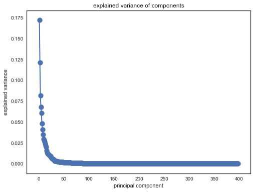
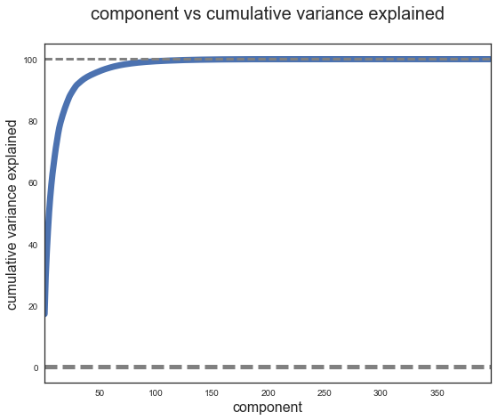

## Summary

This is the modeling part for Outbrain Click Prediction Project. 

After I've done the EDA part (see my previous post: Outbrain Click Prediction EDA) which really helped me understand the data and the structure better, I moved to the feature engineering stage including combining data into an aggregated table, creating new features, scaling data and so on. 

Finally I can have a well-prepared dataset to build models. In this project, I used Logistic Regression, Decision Trees and Keras for the prediction.


## Assumptions

Before I go into the details about my steps, I want to introduce two assumptions for the modeling part.

### 1. Sample Modeling

Due to the large amount of data (87 million rows) I have to make it work on my local computer, I used Sample Modeling approach to train my model. 

I kept the most recent data as a fixed test dataset. Among the rest of the data, I randomly selected 3 train datasets as df_train_1, df_train_2 and df_train_3 for my modeling. This notebook is an example for df_train_1
- train: 0.8 million rows
- test: 0.32 million rows (0.4 train test split)


### 2. NaN Values

Again, due to the large amount of data and very few NaN values, I chose to drop them instead of using imputing methods.


## Steps

### 1. Combining data by SQL
I think the best way to combine large tables like the datasets in this project is SQL - it won't use my local computer's memory. Before I started my analysis in this notebook, I used PostgresSQL queries to aggregate tables. My output are 3 train samples and a test sample that combined all information from click, pageview, event and promoted content tables


### 2. Read & Join data 
Read data from SQL server and join the train / test data with the document tables.


### 3. Feature Engineering
- Create new features: Day, Hour, State, Category difference, Topic difference
- Get dummified variables for categorical columns (Platform Day, Hour and State)
- Data scale


### 4. Modeling
A. Decision Trees: the accuracy score is very close to the baseline, because this model tends to predict much more zeros than ones. Therefore, this model is not very helpful for future predictions
    - Avg. accuracy rate on test data: 0.814
    - Important features: Category difference, Mobile users, Ad category 1503, Ad topic 37
    
B. Logistic Regression: it gives us the probability of an ad to be clicked on. Additionaly, it predicts a good amount of ones.
    - Avg. accuracy rate on test data: 0.747
    - Important features: Ad topic 37 (negative)
    
C. Keras
    - Avg. accuracy rate on test data: 0.776
    - Hard to interpret the results


## Next Steps:
1. Run PCA in order to reduce the # of features
2. More complex models: random forest, deep learning


```python
import numpy as np
import pandas as pd

import datetime

from sklearn.model_selection import cross_val_score, StratifiedKFold, GridSearchCV
from sklearn.tree import DecisionTreeClassifier
from sklearn.ensemble import RandomForestClassifier, ExtraTreesClassifier, BaggingClassifier

from sklearn.model_selection import train_test_split
from sklearn.preprocessing import MinMaxScaler

from sklearn.metrics import accuracy_score, classification_report, confusion_matrix
```


```python
import psycopg2

try:
    conn = psycopg2.connect("dbname='KatieJi' host='localhost'")
except:
    print "I am unable to connect to the database"
```

## Read Data
- Read train sample data 1 as df_train_1
- Read test sample data as df_test
- Read train sample data with document information as df_train_1_doc


```python
c = conn.cursor()
```


```python
# the entire df_train has 87,141,731 rows
df_train_1 = pd.read_sql('SELECT * from df_train_random_1',con=conn)
```


```python
df_test = pd.read_sql('SELECT * from df_test',con=conn)
```


```python
df_train_1.dropna(inplace=True)
```


```python
df_test.dropna(inplace=True)
```


```python
df_test = df_test.drop(['row_number'],axis=1)
```


```python
len(df_train_1)
```


    4999934


```python
len(df_test)
```


    1999953


```python
df_train_1.head()
```


<div>
<table border="1" class="dataframe">
  <thead>
    <tr style="text-align: right;">
      <th></th>
      <th>display_id</th>
      <th>ad_id</th>
      <th>clicked</th>
      <th>ad_document_id</th>
      <th>document_id</th>
      <th>timestamp</th>
      <th>platform</th>
      <th>geo_location</th>
    </tr>
  </thead>
  <tbody>
    <tr>
      <th>0</th>
      <td>9327736</td>
      <td>465857</td>
      <td>0</td>
      <td>2286920</td>
      <td>2381779</td>
      <td>635179742</td>
      <td>2</td>
      <td>IN&gt;16</td>
    </tr>
    <tr>
      <th>1</th>
      <td>7925247</td>
      <td>211592</td>
      <td>0</td>
      <td>1535449</td>
      <td>2113032</td>
      <td>550512614</td>
      <td>1</td>
      <td>US&gt;MO&gt;616</td>
    </tr>
    <tr>
      <th>2</th>
      <td>9205593</td>
      <td>436995</td>
      <td>1</td>
      <td>2109662</td>
      <td>2330651</td>
      <td>626029929</td>
      <td>3</td>
      <td>CA&gt;ON</td>
    </tr>
    <tr>
      <th>3</th>
      <td>3970408</td>
      <td>386928</td>
      <td>0</td>
      <td>1346973</td>
      <td>1585713</td>
      <td>252743480</td>
      <td>1</td>
      <td>US&gt;NC&gt;560</td>
    </tr>
    <tr>
      <th>4</th>
      <td>11278824</td>
      <td>87269</td>
      <td>0</td>
      <td>1110172</td>
      <td>1402366</td>
      <td>749943363</td>
      <td>2</td>
      <td>CA&gt;BC</td>
    </tr>
  </tbody>
</table>
</div>


```python
train_1_doc = pd.read_pickle('train_1_doc_cleaned.pkl')
```


```python
test_doc = pd.read_pickle('test_doc_cleaned.pkl')
```


```python
len(train_1_doc.columns)
```


    402


```python
len(test_doc.columns)
```


    402


```python
train_1_ad_doc = pd.read_pickle('train_1_ad_doc_cleaned.pkl')
```


```python
test_ad_doc = pd.read_pickle('test_ad_doc_cleaned.pkl')
```


```python
len(train_1_ad_doc.columns)
```


    401


```python
len(test_ad_doc.columns)
```


    401


```python
df_train_1 = df_train_1.merge(train_1_doc, on = 'document_id',how='inner' )
```


```python
train_1_ad_doc.columns = ['ad_'+str(col) for col in train_1_ad_doc.columns]
```


```python
train_1_ad_doc.head()
```


<div>
<table border="1" class="dataframe">
  <thead>
    <tr style="text-align: right;">
      <th></th>
      <th>ad_document_id</th>
      <th>ad_1000</th>
      <th>ad_1100</th>
      <th>ad_1200</th>
      <th>ad_1202</th>
      <th>ad_1203</th>
      <th>ad_1204</th>
      <th>ad_1205</th>
      <th>ad_1206</th>
      <th>ad_1207</th>
      <th>...</th>
      <th>ad_290</th>
      <th>ad_291</th>
      <th>ad_292</th>
      <th>ad_293</th>
      <th>ad_294</th>
      <th>ad_295</th>
      <th>ad_296</th>
      <th>ad_297</th>
      <th>ad_298</th>
      <th>ad_299</th>
    </tr>
  </thead>
  <tbody>
    <tr>
      <th>1</th>
      <td>3173</td>
      <td>0.0</td>
      <td>0.0</td>
      <td>0.0</td>
      <td>0.0</td>
      <td>0.00</td>
      <td>0.0</td>
      <td>0.0</td>
      <td>0.00</td>
      <td>0.0</td>
      <td>...</td>
      <td>0.0</td>
      <td>0.0</td>
      <td>0.0</td>
      <td>0.0</td>
      <td>0.0</td>
      <td>0.0</td>
      <td>0.000000</td>
      <td>0.0</td>
      <td>0.0</td>
      <td>0.0</td>
    </tr>
    <tr>
      <th>8</th>
      <td>6399</td>
      <td>0.0</td>
      <td>0.0</td>
      <td>0.0</td>
      <td>0.0</td>
      <td>0.00</td>
      <td>0.0</td>
      <td>0.0</td>
      <td>0.00</td>
      <td>0.0</td>
      <td>...</td>
      <td>0.0</td>
      <td>0.0</td>
      <td>0.0</td>
      <td>0.0</td>
      <td>0.0</td>
      <td>0.0</td>
      <td>0.159124</td>
      <td>0.0</td>
      <td>0.0</td>
      <td>0.0</td>
    </tr>
    <tr>
      <th>9</th>
      <td>7692</td>
      <td>0.0</td>
      <td>0.0</td>
      <td>0.0</td>
      <td>0.0</td>
      <td>0.07</td>
      <td>0.0</td>
      <td>0.0</td>
      <td>0.00</td>
      <td>0.0</td>
      <td>...</td>
      <td>0.0</td>
      <td>0.0</td>
      <td>0.0</td>
      <td>0.0</td>
      <td>0.0</td>
      <td>0.0</td>
      <td>0.000000</td>
      <td>0.0</td>
      <td>0.0</td>
      <td>0.0</td>
    </tr>
    <tr>
      <th>10</th>
      <td>11671</td>
      <td>0.0</td>
      <td>0.0</td>
      <td>0.0</td>
      <td>0.0</td>
      <td>0.00</td>
      <td>0.0</td>
      <td>0.0</td>
      <td>0.00</td>
      <td>0.0</td>
      <td>...</td>
      <td>0.0</td>
      <td>0.0</td>
      <td>0.0</td>
      <td>0.0</td>
      <td>0.0</td>
      <td>0.0</td>
      <td>0.000000</td>
      <td>0.0</td>
      <td>0.0</td>
      <td>0.0</td>
    </tr>
    <tr>
      <th>13</th>
      <td>12668</td>
      <td>0.0</td>
      <td>0.0</td>
      <td>0.0</td>
      <td>0.0</td>
      <td>0.00</td>
      <td>0.0</td>
      <td>0.0</td>
      <td>0.92</td>
      <td>0.0</td>
      <td>...</td>
      <td>0.0</td>
      <td>0.0</td>
      <td>0.0</td>
      <td>0.0</td>
      <td>0.0</td>
      <td>0.0</td>
      <td>0.000000</td>
      <td>0.0</td>
      <td>0.0</td>
      <td>0.0</td>
    </tr>
  </tbody>
</table>
<p>5 rows × 401 columns</p>
</div>


## Join document tables and train / test tables
- Add document information into train sample data 1
- Add document information into test sample data


```python
df_train_1 = df_train_1.merge(train_1_ad_doc, on = 'ad_document_id',how='inner' )
```


```python
df_train_1.dropna(inplace=True)
```


```python
len(df_train_1)
```


    1317750


```python
df_train_1.head()
```


<div>
<table border="1" class="dataframe">
  <thead>
    <tr style="text-align: right;">
      <th></th>
      <th>display_id</th>
      <th>ad_id</th>
      <th>clicked</th>
      <th>ad_document_id</th>
      <th>document_id</th>
      <th>timestamp</th>
      <th>platform</th>
      <th>geo_location</th>
      <th>1000</th>
      <th>1100</th>
      <th>...</th>
      <th>ad_290</th>
      <th>ad_291</th>
      <th>ad_292</th>
      <th>ad_293</th>
      <th>ad_294</th>
      <th>ad_295</th>
      <th>ad_296</th>
      <th>ad_297</th>
      <th>ad_298</th>
      <th>ad_299</th>
    </tr>
  </thead>
  <tbody>
    <tr>
      <th>0</th>
      <td>9568038</td>
      <td>145924</td>
      <td>0</td>
      <td>1148812</td>
      <td>2381779</td>
      <td>647954043</td>
      <td>2</td>
      <td>US</td>
      <td>0.0</td>
      <td>0.0</td>
      <td>...</td>
      <td>0.0</td>
      <td>0.0</td>
      <td>0.0</td>
      <td>0.0</td>
      <td>0.0</td>
      <td>0.0</td>
      <td>0.0</td>
      <td>0.0</td>
      <td>0.0</td>
      <td>0.0</td>
    </tr>
    <tr>
      <th>1</th>
      <td>9723207</td>
      <td>142732</td>
      <td>0</td>
      <td>1148812</td>
      <td>2381779</td>
      <td>655487928</td>
      <td>2</td>
      <td>US&gt;OH&gt;535</td>
      <td>0.0</td>
      <td>0.0</td>
      <td>...</td>
      <td>0.0</td>
      <td>0.0</td>
      <td>0.0</td>
      <td>0.0</td>
      <td>0.0</td>
      <td>0.0</td>
      <td>0.0</td>
      <td>0.0</td>
      <td>0.0</td>
      <td>0.0</td>
    </tr>
    <tr>
      <th>2</th>
      <td>10049392</td>
      <td>145924</td>
      <td>0</td>
      <td>1148812</td>
      <td>2381779</td>
      <td>671399752</td>
      <td>2</td>
      <td>US&gt;IL&gt;602</td>
      <td>0.0</td>
      <td>0.0</td>
      <td>...</td>
      <td>0.0</td>
      <td>0.0</td>
      <td>0.0</td>
      <td>0.0</td>
      <td>0.0</td>
      <td>0.0</td>
      <td>0.0</td>
      <td>0.0</td>
      <td>0.0</td>
      <td>0.0</td>
    </tr>
    <tr>
      <th>3</th>
      <td>10370992</td>
      <td>189810</td>
      <td>1</td>
      <td>1148812</td>
      <td>2353654</td>
      <td>691096022</td>
      <td>2</td>
      <td>US</td>
      <td>0.0</td>
      <td>0.0</td>
      <td>...</td>
      <td>0.0</td>
      <td>0.0</td>
      <td>0.0</td>
      <td>0.0</td>
      <td>0.0</td>
      <td>0.0</td>
      <td>0.0</td>
      <td>0.0</td>
      <td>0.0</td>
      <td>0.0</td>
    </tr>
    <tr>
      <th>4</th>
      <td>9456525</td>
      <td>189812</td>
      <td>0</td>
      <td>1148812</td>
      <td>2353654</td>
      <td>642108520</td>
      <td>2</td>
      <td>US&gt;CA&gt;807</td>
      <td>0.0</td>
      <td>0.0</td>
      <td>...</td>
      <td>0.0</td>
      <td>0.0</td>
      <td>0.0</td>
      <td>0.0</td>
      <td>0.0</td>
      <td>0.0</td>
      <td>0.0</td>
      <td>0.0</td>
      <td>0.0</td>
      <td>0.0</td>
    </tr>
  </tbody>
</table>
<p>5 rows × 809 columns</p>
</div>


```python
df_test = df_test.merge(test_doc, on = 'document_id',how='inner' )
```


```python
test_ad_doc.columns = ['ad_'+str(col) for col in test_ad_doc.columns]
```


```python
df_test = df_test.merge(test_ad_doc, on = 'ad_document_id',how='inner' )
```


```python
df_test.dropna(inplace=True)
```


```python
len(df_test)
```


    445025


```python
df_test.head()
```


<div>
<table border="1" class="dataframe">
  <thead>
    <tr style="text-align: right;">
      <th></th>
      <th>display_id</th>
      <th>ad_id</th>
      <th>clicked</th>
      <th>ad_document_id</th>
      <th>document_id</th>
      <th>timestamp</th>
      <th>platform</th>
      <th>geo_location</th>
      <th>row_number</th>
      <th>1000</th>
      <th>...</th>
      <th>ad_290</th>
      <th>ad_291</th>
      <th>ad_292</th>
      <th>ad_293</th>
      <th>ad_294</th>
      <th>ad_295</th>
      <th>ad_296</th>
      <th>ad_297</th>
      <th>ad_298</th>
      <th>ad_299</th>
    </tr>
  </thead>
  <tbody>
    <tr>
      <th>0</th>
      <td>16871271</td>
      <td>547924</td>
      <td>0</td>
      <td>2823769</td>
      <td>300181</td>
      <td>1122973454</td>
      <td>2</td>
      <td>US&gt;MN&gt;613</td>
      <td>3</td>
      <td>0.0</td>
      <td>...</td>
      <td>0.0</td>
      <td>0.0</td>
      <td>0.0</td>
      <td>0.0</td>
      <td>0.0</td>
      <td>0.0</td>
      <td>0.0</td>
      <td>0.0</td>
      <td>0.0</td>
      <td>0.0</td>
    </tr>
    <tr>
      <th>1</th>
      <td>16458028</td>
      <td>546572</td>
      <td>1</td>
      <td>2803551</td>
      <td>300181</td>
      <td>1097299961</td>
      <td>2</td>
      <td>US&gt;FL&gt;539</td>
      <td>3873</td>
      <td>0.0</td>
      <td>...</td>
      <td>0.0</td>
      <td>0.0</td>
      <td>0.0</td>
      <td>0.0</td>
      <td>0.0</td>
      <td>0.0</td>
      <td>0.0</td>
      <td>0.0</td>
      <td>0.0</td>
      <td>0.0</td>
    </tr>
    <tr>
      <th>2</th>
      <td>16462654</td>
      <td>546572</td>
      <td>0</td>
      <td>2803551</td>
      <td>2794894</td>
      <td>1097582191</td>
      <td>2</td>
      <td>US&gt;NM&gt;790</td>
      <td>3857</td>
      <td>0.0</td>
      <td>...</td>
      <td>0.0</td>
      <td>0.0</td>
      <td>0.0</td>
      <td>0.0</td>
      <td>0.0</td>
      <td>0.0</td>
      <td>0.0</td>
      <td>0.0</td>
      <td>0.0</td>
      <td>0.0</td>
    </tr>
    <tr>
      <th>3</th>
      <td>16447853</td>
      <td>546572</td>
      <td>0</td>
      <td>2803551</td>
      <td>65310</td>
      <td>1096695884</td>
      <td>2</td>
      <td>US&gt;TX</td>
      <td>3859</td>
      <td>0.0</td>
      <td>...</td>
      <td>0.0</td>
      <td>0.0</td>
      <td>0.0</td>
      <td>0.0</td>
      <td>0.0</td>
      <td>0.0</td>
      <td>0.0</td>
      <td>0.0</td>
      <td>0.0</td>
      <td>0.0</td>
    </tr>
    <tr>
      <th>4</th>
      <td>16458527</td>
      <td>546572</td>
      <td>0</td>
      <td>2803551</td>
      <td>65310</td>
      <td>1097331155</td>
      <td>2</td>
      <td>US&gt;CA&gt;807</td>
      <td>3867</td>
      <td>0.0</td>
      <td>...</td>
      <td>0.0</td>
      <td>0.0</td>
      <td>0.0</td>
      <td>0.0</td>
      <td>0.0</td>
      <td>0.0</td>
      <td>0.0</td>
      <td>0.0</td>
      <td>0.0</td>
      <td>0.0</td>
    </tr>
  </tbody>
</table>
<p>5 rows × 810 columns</p>
</div>


## Feature Engineering Part I
- Extracted Hour and Day data from timestamp
- Extracted State data from timestamp - if the traffic came from out of US, use 'Outside US' for the State column
- Clean data format for Platform column

### 1. Extracted Hour and Day data from timestamp (train data)


```python
df_train_1['datetime'] = df_train_1.timestamp.apply(lambda x: datetime.datetime.fromtimestamp((int(x)+1465876799998)/1000.0).\
                             strftime('%Y-%m-%d %H:%M:%S.%f'))
```


```python
df_train_1['hour'] = df_train_1['datetime'].apply(lambda x: x[11:13])
df_train_1['day'] = df_train_1['datetime'].apply(lambda x: x[:10])
```

### 2. Extracted State data from timestamp (train data)


```python
def extract_state(x):
    if str(x)[0:2] == 'US':
        try:
            y = str(x)[3:5]
        except:
            y = np.nan
    else:
        y = 'Outside US'
    return y
```


```python
df_train_1['state'] = df_train_1.geo_location.apply(lambda x: extract_state(x))
```


```python
df_train_1.head()
```


<div>
<table border="1" class="dataframe">
  <thead>
    <tr style="text-align: right;">
      <th></th>
      <th>display_id</th>
      <th>ad_id</th>
      <th>clicked</th>
      <th>ad_document_id</th>
      <th>document_id</th>
      <th>timestamp</th>
      <th>platform</th>
      <th>geo_location</th>
      <th>1000</th>
      <th>1100</th>
      <th>...</th>
      <th>ad_295</th>
      <th>ad_296</th>
      <th>ad_297</th>
      <th>ad_298</th>
      <th>ad_299</th>
      <th>datetime</th>
      <th>hour</th>
      <th>day</th>
      <th>country</th>
      <th>state</th>
    </tr>
  </thead>
  <tbody>
    <tr>
      <th>0</th>
      <td>9568038</td>
      <td>145924</td>
      <td>0</td>
      <td>1148812</td>
      <td>2381779</td>
      <td>647954043</td>
      <td>2</td>
      <td>US</td>
      <td>0.0</td>
      <td>0.0</td>
      <td>...</td>
      <td>0.0</td>
      <td>0.0</td>
      <td>0.0</td>
      <td>0.0</td>
      <td>0.0</td>
      <td>2016-06-21 11:59:14.041000</td>
      <td>11</td>
      <td>2016-06-21</td>
      <td>US</td>
      <td></td>
    </tr>
    <tr>
      <th>1</th>
      <td>9723207</td>
      <td>142732</td>
      <td>0</td>
      <td>1148812</td>
      <td>2381779</td>
      <td>655487928</td>
      <td>2</td>
      <td>US&gt;OH&gt;535</td>
      <td>0.0</td>
      <td>0.0</td>
      <td>...</td>
      <td>0.0</td>
      <td>0.0</td>
      <td>0.0</td>
      <td>0.0</td>
      <td>0.0</td>
      <td>2016-06-21 14:04:47.926000</td>
      <td>14</td>
      <td>2016-06-21</td>
      <td>US</td>
      <td>OH</td>
    </tr>
    <tr>
      <th>2</th>
      <td>10049392</td>
      <td>145924</td>
      <td>0</td>
      <td>1148812</td>
      <td>2381779</td>
      <td>671399752</td>
      <td>2</td>
      <td>US&gt;IL&gt;602</td>
      <td>0.0</td>
      <td>0.0</td>
      <td>...</td>
      <td>0.0</td>
      <td>0.0</td>
      <td>0.0</td>
      <td>0.0</td>
      <td>0.0</td>
      <td>2016-06-21 18:29:59.750000</td>
      <td>18</td>
      <td>2016-06-21</td>
      <td>US</td>
      <td>IL</td>
    </tr>
    <tr>
      <th>3</th>
      <td>10370992</td>
      <td>189810</td>
      <td>1</td>
      <td>1148812</td>
      <td>2353654</td>
      <td>691096022</td>
      <td>2</td>
      <td>US</td>
      <td>0.0</td>
      <td>0.0</td>
      <td>...</td>
      <td>0.0</td>
      <td>0.0</td>
      <td>0.0</td>
      <td>0.0</td>
      <td>0.0</td>
      <td>2016-06-21 23:58:16.020000</td>
      <td>23</td>
      <td>2016-06-21</td>
      <td>US</td>
      <td></td>
    </tr>
    <tr>
      <th>4</th>
      <td>9456525</td>
      <td>189812</td>
      <td>0</td>
      <td>1148812</td>
      <td>2353654</td>
      <td>642108520</td>
      <td>2</td>
      <td>US&gt;CA&gt;807</td>
      <td>0.0</td>
      <td>0.0</td>
      <td>...</td>
      <td>0.0</td>
      <td>0.0</td>
      <td>0.0</td>
      <td>0.0</td>
      <td>0.0</td>
      <td>2016-06-21 10:21:48.518000</td>
      <td>10</td>
      <td>2016-06-21</td>
      <td>US</td>
      <td>CA</td>
    </tr>
  </tbody>
</table>
<p>5 rows × 814 columns</p>
</div>


```python
df_train_1 = df_train_1.drop(['timestamp','datetime','geo_location'],axis=1)
```


```python
df_train_1.head()
```


<div>
<table border="1" class="dataframe">
  <thead>
    <tr style="text-align: right;">
      <th></th>
      <th>display_id</th>
      <th>ad_id</th>
      <th>clicked</th>
      <th>ad_document_id</th>
      <th>document_id</th>
      <th>platform</th>
      <th>1000</th>
      <th>1100</th>
      <th>1200</th>
      <th>1202</th>
      <th>...</th>
      <th>ad_294</th>
      <th>ad_295</th>
      <th>ad_296</th>
      <th>ad_297</th>
      <th>ad_298</th>
      <th>ad_299</th>
      <th>hour</th>
      <th>day</th>
      <th>country</th>
      <th>state</th>
    </tr>
  </thead>
  <tbody>
    <tr>
      <th>0</th>
      <td>9568038</td>
      <td>145924</td>
      <td>0</td>
      <td>1148812</td>
      <td>2381779</td>
      <td>2</td>
      <td>0.0</td>
      <td>0.0</td>
      <td>0.0</td>
      <td>0.0</td>
      <td>...</td>
      <td>0.0</td>
      <td>0.0</td>
      <td>0.0</td>
      <td>0.0</td>
      <td>0.0</td>
      <td>0.0</td>
      <td>11</td>
      <td>2016-06-21</td>
      <td>US</td>
      <td></td>
    </tr>
    <tr>
      <th>1</th>
      <td>9723207</td>
      <td>142732</td>
      <td>0</td>
      <td>1148812</td>
      <td>2381779</td>
      <td>2</td>
      <td>0.0</td>
      <td>0.0</td>
      <td>0.0</td>
      <td>0.0</td>
      <td>...</td>
      <td>0.0</td>
      <td>0.0</td>
      <td>0.0</td>
      <td>0.0</td>
      <td>0.0</td>
      <td>0.0</td>
      <td>14</td>
      <td>2016-06-21</td>
      <td>US</td>
      <td>OH</td>
    </tr>
    <tr>
      <th>2</th>
      <td>10049392</td>
      <td>145924</td>
      <td>0</td>
      <td>1148812</td>
      <td>2381779</td>
      <td>2</td>
      <td>0.0</td>
      <td>0.0</td>
      <td>0.0</td>
      <td>0.0</td>
      <td>...</td>
      <td>0.0</td>
      <td>0.0</td>
      <td>0.0</td>
      <td>0.0</td>
      <td>0.0</td>
      <td>0.0</td>
      <td>18</td>
      <td>2016-06-21</td>
      <td>US</td>
      <td>IL</td>
    </tr>
    <tr>
      <th>3</th>
      <td>10370992</td>
      <td>189810</td>
      <td>1</td>
      <td>1148812</td>
      <td>2353654</td>
      <td>2</td>
      <td>0.0</td>
      <td>0.0</td>
      <td>0.0</td>
      <td>0.0</td>
      <td>...</td>
      <td>0.0</td>
      <td>0.0</td>
      <td>0.0</td>
      <td>0.0</td>
      <td>0.0</td>
      <td>0.0</td>
      <td>23</td>
      <td>2016-06-21</td>
      <td>US</td>
      <td></td>
    </tr>
    <tr>
      <th>4</th>
      <td>9456525</td>
      <td>189812</td>
      <td>0</td>
      <td>1148812</td>
      <td>2353654</td>
      <td>2</td>
      <td>0.0</td>
      <td>0.0</td>
      <td>0.0</td>
      <td>0.0</td>
      <td>...</td>
      <td>0.0</td>
      <td>0.0</td>
      <td>0.0</td>
      <td>0.0</td>
      <td>0.0</td>
      <td>0.0</td>
      <td>10</td>
      <td>2016-06-21</td>
      <td>US</td>
      <td>CA</td>
    </tr>
  </tbody>
</table>
<p>5 rows × 811 columns</p>
</div>


```python
len(df_train_1.day.unique())
```


    13


```python
len(df_train_1.hour.unique())
```


    24


```python
len(df_train_1.state.unique())
```


    56


```python
len(df_train_1.country.unique())
```


    221


```python
len(df_train_1.platform.unique())
```


    3


```python
len(df_test.day.unique())
```


    6


```python
len(df_test.hour.unique())
```


    24


```python
len(df_test.state.unique())
```


    55


```python
len(df_test.country.unique())
```


    215


```python
df_test.platform.unique()
```


    array(['2', '1', '3'], dtype=object)


### 3. Extracted Hour and Day data from timestamp (test data)


```python
df_test['datetime'] = df_test.timestamp.apply(lambda x: datetime.datetime.fromtimestamp((int(x)+1465876799998)/1000.0).\
                             strftime('%Y-%m-%d %H:%M:%S.%f'))
```


```python
df_test['hour'] = df_test['datetime'].apply(lambda x: x[11:13])
df_test['day'] = df_test['datetime'].apply(lambda x: x[:10])
```

### 4. Extracted State data from timestamp (test data)


```python
df_test['state'] = df_test.geo_location.apply(lambda x: extract_state(x))
```


```python
df_test.head()
```


<div>
<table border="1" class="dataframe">
  <thead>
    <tr style="text-align: right;">
      <th></th>
      <th>display_id</th>
      <th>ad_id</th>
      <th>clicked</th>
      <th>ad_document_id</th>
      <th>document_id</th>
      <th>timestamp</th>
      <th>platform</th>
      <th>geo_location</th>
      <th>row_number</th>
      <th>1000</th>
      <th>...</th>
      <th>ad_295</th>
      <th>ad_296</th>
      <th>ad_297</th>
      <th>ad_298</th>
      <th>ad_299</th>
      <th>datetime</th>
      <th>hour</th>
      <th>day</th>
      <th>country</th>
      <th>state</th>
    </tr>
  </thead>
  <tbody>
    <tr>
      <th>0</th>
      <td>16871271</td>
      <td>547924</td>
      <td>0</td>
      <td>2823769</td>
      <td>300181</td>
      <td>1122973454</td>
      <td>2</td>
      <td>US&gt;MN&gt;613</td>
      <td>3</td>
      <td>0.0</td>
      <td>...</td>
      <td>0.0</td>
      <td>0.0</td>
      <td>0.0</td>
      <td>0.0</td>
      <td>0.0</td>
      <td>2016-06-26 23:56:13.452000</td>
      <td>23</td>
      <td>2016-06-26</td>
      <td>US</td>
      <td>MN</td>
    </tr>
    <tr>
      <th>1</th>
      <td>16458028</td>
      <td>546572</td>
      <td>1</td>
      <td>2803551</td>
      <td>300181</td>
      <td>1097299961</td>
      <td>2</td>
      <td>US&gt;FL&gt;539</td>
      <td>3873</td>
      <td>0.0</td>
      <td>...</td>
      <td>0.0</td>
      <td>0.0</td>
      <td>0.0</td>
      <td>0.0</td>
      <td>0.0</td>
      <td>2016-06-26 16:48:19.959000</td>
      <td>16</td>
      <td>2016-06-26</td>
      <td>US</td>
      <td>FL</td>
    </tr>
    <tr>
      <th>2</th>
      <td>16462654</td>
      <td>546572</td>
      <td>0</td>
      <td>2803551</td>
      <td>2794894</td>
      <td>1097582191</td>
      <td>2</td>
      <td>US&gt;NM&gt;790</td>
      <td>3857</td>
      <td>0.0</td>
      <td>...</td>
      <td>0.0</td>
      <td>0.0</td>
      <td>0.0</td>
      <td>0.0</td>
      <td>0.0</td>
      <td>2016-06-26 16:53:02.189000</td>
      <td>16</td>
      <td>2016-06-26</td>
      <td>US</td>
      <td>NM</td>
    </tr>
    <tr>
      <th>3</th>
      <td>16447853</td>
      <td>546572</td>
      <td>0</td>
      <td>2803551</td>
      <td>65310</td>
      <td>1096695884</td>
      <td>2</td>
      <td>US&gt;TX</td>
      <td>3859</td>
      <td>0.0</td>
      <td>...</td>
      <td>0.0</td>
      <td>0.0</td>
      <td>0.0</td>
      <td>0.0</td>
      <td>0.0</td>
      <td>2016-06-26 16:38:15.882000</td>
      <td>16</td>
      <td>2016-06-26</td>
      <td>US</td>
      <td>TX</td>
    </tr>
    <tr>
      <th>4</th>
      <td>16458527</td>
      <td>546572</td>
      <td>0</td>
      <td>2803551</td>
      <td>65310</td>
      <td>1097331155</td>
      <td>2</td>
      <td>US&gt;CA&gt;807</td>
      <td>3867</td>
      <td>0.0</td>
      <td>...</td>
      <td>0.0</td>
      <td>0.0</td>
      <td>0.0</td>
      <td>0.0</td>
      <td>0.0</td>
      <td>2016-06-26 16:48:51.153000</td>
      <td>16</td>
      <td>2016-06-26</td>
      <td>US</td>
      <td>CA</td>
    </tr>
  </tbody>
</table>
<p>5 rows × 815 columns</p>
</div>


```python
df_test = df_test.drop(['timestamp','datetime','geo_location'],axis=1)
```


```python
df_test.head()
```


<div>
<table border="1" class="dataframe">
  <thead>
    <tr style="text-align: right;">
      <th></th>
      <th>display_id</th>
      <th>ad_id</th>
      <th>clicked</th>
      <th>ad_document_id</th>
      <th>document_id</th>
      <th>platform</th>
      <th>row_number</th>
      <th>1000</th>
      <th>1100</th>
      <th>1200</th>
      <th>...</th>
      <th>ad_294</th>
      <th>ad_295</th>
      <th>ad_296</th>
      <th>ad_297</th>
      <th>ad_298</th>
      <th>ad_299</th>
      <th>hour</th>
      <th>day</th>
      <th>country</th>
      <th>state</th>
    </tr>
  </thead>
  <tbody>
    <tr>
      <th>0</th>
      <td>16871271</td>
      <td>547924</td>
      <td>0</td>
      <td>2823769</td>
      <td>300181</td>
      <td>2</td>
      <td>3</td>
      <td>0.0</td>
      <td>0.000000</td>
      <td>0.0</td>
      <td>...</td>
      <td>0.0</td>
      <td>0.0</td>
      <td>0.0</td>
      <td>0.0</td>
      <td>0.0</td>
      <td>0.0</td>
      <td>23</td>
      <td>2016-06-26</td>
      <td>US</td>
      <td>MN</td>
    </tr>
    <tr>
      <th>1</th>
      <td>16458028</td>
      <td>546572</td>
      <td>1</td>
      <td>2803551</td>
      <td>300181</td>
      <td>2</td>
      <td>3873</td>
      <td>0.0</td>
      <td>0.000000</td>
      <td>0.0</td>
      <td>...</td>
      <td>0.0</td>
      <td>0.0</td>
      <td>0.0</td>
      <td>0.0</td>
      <td>0.0</td>
      <td>0.0</td>
      <td>16</td>
      <td>2016-06-26</td>
      <td>US</td>
      <td>FL</td>
    </tr>
    <tr>
      <th>2</th>
      <td>16462654</td>
      <td>546572</td>
      <td>0</td>
      <td>2803551</td>
      <td>2794894</td>
      <td>2</td>
      <td>3857</td>
      <td>0.0</td>
      <td>0.000000</td>
      <td>0.0</td>
      <td>...</td>
      <td>0.0</td>
      <td>0.0</td>
      <td>0.0</td>
      <td>0.0</td>
      <td>0.0</td>
      <td>0.0</td>
      <td>16</td>
      <td>2016-06-26</td>
      <td>US</td>
      <td>NM</td>
    </tr>
    <tr>
      <th>3</th>
      <td>16447853</td>
      <td>546572</td>
      <td>0</td>
      <td>2803551</td>
      <td>65310</td>
      <td>2</td>
      <td>3859</td>
      <td>0.0</td>
      <td>0.058407</td>
      <td>0.0</td>
      <td>...</td>
      <td>0.0</td>
      <td>0.0</td>
      <td>0.0</td>
      <td>0.0</td>
      <td>0.0</td>
      <td>0.0</td>
      <td>16</td>
      <td>2016-06-26</td>
      <td>US</td>
      <td>TX</td>
    </tr>
    <tr>
      <th>4</th>
      <td>16458527</td>
      <td>546572</td>
      <td>0</td>
      <td>2803551</td>
      <td>65310</td>
      <td>2</td>
      <td>3867</td>
      <td>0.0</td>
      <td>0.058407</td>
      <td>0.0</td>
      <td>...</td>
      <td>0.0</td>
      <td>0.0</td>
      <td>0.0</td>
      <td>0.0</td>
      <td>0.0</td>
      <td>0.0</td>
      <td>16</td>
      <td>2016-06-26</td>
      <td>US</td>
      <td>CA</td>
    </tr>
  </tbody>
</table>
<p>5 rows × 812 columns</p>
</div>


### 5. Clean data format for Platform column (test data)


```python
df_test.platform = df_test.platform.map(lambda x: '1' if x == '\\N' else x)
```

## Feature Engineering Part II
- Get dummies for Platform and Hour columns
- Use Count Vectorizer for Day and State columns
- Create X and y varibles
- Create cat_diff and topic_diff columns
- Data scaling

### 1. Get dummies for Platform and Hour columns


```python
df_test = pd.get_dummies(df_test,columns=['platform','hour'],drop_first=True)
```


```python
df_train_1 = pd.get_dummies(df_train_1,columns=['platform','hour'],drop_first=True)
```


```python
df_test = df_test.head(320000)
```


```python
df_test = df_test.drop(['display_id','ad_id','document_id','ad_document_id'],axis=1)
```


```python
df_test = df_test.drop(['publisher_id','publish_time','source_id','ad_source_id','ad_publisher_id','ad_publish_time'],axis=1)
```


```python
df_train_1 = df_train_1.head(800000)
```


```python
df_train_1 = df_train_1.drop(['display_id','ad_id','document_id','ad_document_id'],axis=1)
```


```python
df_train_1 = df_train_1.drop(['publisher_id','publish_time','source_id','ad_source_id','ad_publisher_id','ad_publish_time'],axis=1)
```


```python
len(X)
```


    445025


### 2. Use Count Vectorizer for Day and State columns


```python
from sklearn.feature_extraction.text import CountVectorizer
v = CountVectorizer(binary=True)

v = v.fit(df_train_1['day'])
df_train_1_day = v.transform(df_train_1['day']).todense()
df_train_1_day = pd.DataFrame(df_train_1_day, columns=v.get_feature_names())
```


```python
df_test_day = v.transform(df_test['day']).todense()
df_test_day = pd.DataFrame(df_test_day, columns=v.get_feature_names())
```


```python
df_test_day.head()
```


<div>
<table border="1" class="dataframe">
  <thead>
    <tr style="text-align: right;">
      <th></th>
      <th>06</th>
      <th>14</th>
      <th>15</th>
      <th>16</th>
      <th>17</th>
      <th>18</th>
      <th>19</th>
      <th>20</th>
      <th>2016</th>
      <th>21</th>
      <th>22</th>
      <th>23</th>
      <th>24</th>
      <th>25</th>
      <th>26</th>
    </tr>
  </thead>
  <tbody>
    <tr>
      <th>0</th>
      <td>1</td>
      <td>0</td>
      <td>0</td>
      <td>0</td>
      <td>0</td>
      <td>0</td>
      <td>0</td>
      <td>0</td>
      <td>1</td>
      <td>0</td>
      <td>0</td>
      <td>0</td>
      <td>0</td>
      <td>0</td>
      <td>1</td>
    </tr>
    <tr>
      <th>1</th>
      <td>1</td>
      <td>0</td>
      <td>0</td>
      <td>0</td>
      <td>0</td>
      <td>0</td>
      <td>0</td>
      <td>0</td>
      <td>1</td>
      <td>0</td>
      <td>0</td>
      <td>0</td>
      <td>0</td>
      <td>0</td>
      <td>1</td>
    </tr>
    <tr>
      <th>2</th>
      <td>1</td>
      <td>0</td>
      <td>0</td>
      <td>0</td>
      <td>0</td>
      <td>0</td>
      <td>0</td>
      <td>0</td>
      <td>1</td>
      <td>0</td>
      <td>0</td>
      <td>0</td>
      <td>0</td>
      <td>0</td>
      <td>1</td>
    </tr>
    <tr>
      <th>3</th>
      <td>1</td>
      <td>0</td>
      <td>0</td>
      <td>0</td>
      <td>0</td>
      <td>0</td>
      <td>0</td>
      <td>0</td>
      <td>1</td>
      <td>0</td>
      <td>0</td>
      <td>0</td>
      <td>0</td>
      <td>0</td>
      <td>1</td>
    </tr>
    <tr>
      <th>4</th>
      <td>1</td>
      <td>0</td>
      <td>0</td>
      <td>0</td>
      <td>0</td>
      <td>0</td>
      <td>0</td>
      <td>0</td>
      <td>1</td>
      <td>0</td>
      <td>0</td>
      <td>0</td>
      <td>0</td>
      <td>0</td>
      <td>1</td>
    </tr>
  </tbody>
</table>
</div>


```python
df_train_1_day.head()
```


<div>
<table border="1" class="dataframe">
  <thead>
    <tr style="text-align: right;">
      <th></th>
      <th>06</th>
      <th>14</th>
      <th>15</th>
      <th>16</th>
      <th>17</th>
      <th>18</th>
      <th>19</th>
      <th>20</th>
      <th>2016</th>
      <th>21</th>
      <th>22</th>
      <th>23</th>
      <th>24</th>
      <th>25</th>
      <th>26</th>
    </tr>
  </thead>
  <tbody>
    <tr>
      <th>0</th>
      <td>1</td>
      <td>0</td>
      <td>0</td>
      <td>0</td>
      <td>0</td>
      <td>0</td>
      <td>0</td>
      <td>0</td>
      <td>1</td>
      <td>1</td>
      <td>0</td>
      <td>0</td>
      <td>0</td>
      <td>0</td>
      <td>0</td>
    </tr>
    <tr>
      <th>1</th>
      <td>1</td>
      <td>0</td>
      <td>0</td>
      <td>0</td>
      <td>0</td>
      <td>0</td>
      <td>0</td>
      <td>0</td>
      <td>1</td>
      <td>1</td>
      <td>0</td>
      <td>0</td>
      <td>0</td>
      <td>0</td>
      <td>0</td>
    </tr>
    <tr>
      <th>2</th>
      <td>1</td>
      <td>0</td>
      <td>0</td>
      <td>0</td>
      <td>0</td>
      <td>0</td>
      <td>0</td>
      <td>0</td>
      <td>1</td>
      <td>1</td>
      <td>0</td>
      <td>0</td>
      <td>0</td>
      <td>0</td>
      <td>0</td>
    </tr>
    <tr>
      <th>3</th>
      <td>1</td>
      <td>0</td>
      <td>0</td>
      <td>0</td>
      <td>0</td>
      <td>0</td>
      <td>0</td>
      <td>0</td>
      <td>1</td>
      <td>1</td>
      <td>0</td>
      <td>0</td>
      <td>0</td>
      <td>0</td>
      <td>0</td>
    </tr>
    <tr>
      <th>4</th>
      <td>1</td>
      <td>0</td>
      <td>0</td>
      <td>0</td>
      <td>0</td>
      <td>0</td>
      <td>0</td>
      <td>0</td>
      <td>1</td>
      <td>1</td>
      <td>0</td>
      <td>0</td>
      <td>0</td>
      <td>0</td>
      <td>0</td>
    </tr>
  </tbody>
</table>
</div>


```python
from sklearn.feature_extraction.text import CountVectorizer
v = CountVectorizer(binary=True)

v = v.fit(df_train_1['state'])
df_train_1_state = v.transform(df_train_1['state']).todense()
df_train_1_state = pd.DataFrame(df_train_1_state, columns=v.get_feature_names())
```


```python
df_test_state = v.transform(df_test['state']).todense()
df_test_state = pd.DataFrame(df_test_state, columns=v.get_feature_names())
```


```python
df_train_1_state.head()
```


<div>
<table border="1" class="dataframe">
  <thead>
    <tr style="text-align: right;">
      <th></th>
      <th>aa</th>
      <th>ae</th>
      <th>ak</th>
      <th>al</th>
      <th>ap</th>
      <th>ar</th>
      <th>az</th>
      <th>ca</th>
      <th>co</th>
      <th>ct</th>
      <th>...</th>
      <th>tn</th>
      <th>tx</th>
      <th>us</th>
      <th>ut</th>
      <th>va</th>
      <th>vt</th>
      <th>wa</th>
      <th>wi</th>
      <th>wv</th>
      <th>wy</th>
    </tr>
  </thead>
  <tbody>
    <tr>
      <th>0</th>
      <td>0</td>
      <td>0</td>
      <td>0</td>
      <td>0</td>
      <td>0</td>
      <td>0</td>
      <td>0</td>
      <td>0</td>
      <td>0</td>
      <td>0</td>
      <td>...</td>
      <td>0</td>
      <td>0</td>
      <td>0</td>
      <td>0</td>
      <td>0</td>
      <td>0</td>
      <td>0</td>
      <td>0</td>
      <td>0</td>
      <td>0</td>
    </tr>
    <tr>
      <th>1</th>
      <td>0</td>
      <td>0</td>
      <td>0</td>
      <td>0</td>
      <td>0</td>
      <td>0</td>
      <td>0</td>
      <td>0</td>
      <td>0</td>
      <td>0</td>
      <td>...</td>
      <td>0</td>
      <td>0</td>
      <td>0</td>
      <td>0</td>
      <td>0</td>
      <td>0</td>
      <td>0</td>
      <td>0</td>
      <td>0</td>
      <td>0</td>
    </tr>
    <tr>
      <th>2</th>
      <td>0</td>
      <td>0</td>
      <td>0</td>
      <td>0</td>
      <td>0</td>
      <td>0</td>
      <td>0</td>
      <td>0</td>
      <td>0</td>
      <td>0</td>
      <td>...</td>
      <td>0</td>
      <td>0</td>
      <td>0</td>
      <td>0</td>
      <td>0</td>
      <td>0</td>
      <td>0</td>
      <td>0</td>
      <td>0</td>
      <td>0</td>
    </tr>
    <tr>
      <th>3</th>
      <td>0</td>
      <td>0</td>
      <td>0</td>
      <td>0</td>
      <td>0</td>
      <td>0</td>
      <td>0</td>
      <td>0</td>
      <td>0</td>
      <td>0</td>
      <td>...</td>
      <td>0</td>
      <td>0</td>
      <td>0</td>
      <td>0</td>
      <td>0</td>
      <td>0</td>
      <td>0</td>
      <td>0</td>
      <td>0</td>
      <td>0</td>
    </tr>
    <tr>
      <th>4</th>
      <td>0</td>
      <td>0</td>
      <td>0</td>
      <td>0</td>
      <td>0</td>
      <td>0</td>
      <td>0</td>
      <td>1</td>
      <td>0</td>
      <td>0</td>
      <td>...</td>
      <td>0</td>
      <td>0</td>
      <td>0</td>
      <td>0</td>
      <td>0</td>
      <td>0</td>
      <td>0</td>
      <td>0</td>
      <td>0</td>
      <td>0</td>
    </tr>
  </tbody>
</table>
<p>5 rows × 56 columns</p>
</div>


```python
df_test_state.head()
```


<div>
<table border="1" class="dataframe">
  <thead>
    <tr style="text-align: right;">
      <th></th>
      <th>aa</th>
      <th>ae</th>
      <th>ak</th>
      <th>al</th>
      <th>ap</th>
      <th>ar</th>
      <th>az</th>
      <th>ca</th>
      <th>co</th>
      <th>ct</th>
      <th>...</th>
      <th>tn</th>
      <th>tx</th>
      <th>us</th>
      <th>ut</th>
      <th>va</th>
      <th>vt</th>
      <th>wa</th>
      <th>wi</th>
      <th>wv</th>
      <th>wy</th>
    </tr>
  </thead>
  <tbody>
    <tr>
      <th>0</th>
      <td>0</td>
      <td>0</td>
      <td>0</td>
      <td>0</td>
      <td>0</td>
      <td>0</td>
      <td>0</td>
      <td>0</td>
      <td>0</td>
      <td>0</td>
      <td>...</td>
      <td>0</td>
      <td>0</td>
      <td>0</td>
      <td>0</td>
      <td>0</td>
      <td>0</td>
      <td>0</td>
      <td>0</td>
      <td>0</td>
      <td>0</td>
    </tr>
    <tr>
      <th>1</th>
      <td>0</td>
      <td>0</td>
      <td>0</td>
      <td>0</td>
      <td>0</td>
      <td>0</td>
      <td>0</td>
      <td>0</td>
      <td>0</td>
      <td>0</td>
      <td>...</td>
      <td>0</td>
      <td>0</td>
      <td>0</td>
      <td>0</td>
      <td>0</td>
      <td>0</td>
      <td>0</td>
      <td>0</td>
      <td>0</td>
      <td>0</td>
    </tr>
    <tr>
      <th>2</th>
      <td>0</td>
      <td>0</td>
      <td>0</td>
      <td>0</td>
      <td>0</td>
      <td>0</td>
      <td>0</td>
      <td>0</td>
      <td>0</td>
      <td>0</td>
      <td>...</td>
      <td>0</td>
      <td>0</td>
      <td>0</td>
      <td>0</td>
      <td>0</td>
      <td>0</td>
      <td>0</td>
      <td>0</td>
      <td>0</td>
      <td>0</td>
    </tr>
    <tr>
      <th>3</th>
      <td>0</td>
      <td>0</td>
      <td>0</td>
      <td>0</td>
      <td>0</td>
      <td>0</td>
      <td>0</td>
      <td>0</td>
      <td>0</td>
      <td>0</td>
      <td>...</td>
      <td>0</td>
      <td>1</td>
      <td>0</td>
      <td>0</td>
      <td>0</td>
      <td>0</td>
      <td>0</td>
      <td>0</td>
      <td>0</td>
      <td>0</td>
    </tr>
    <tr>
      <th>4</th>
      <td>0</td>
      <td>0</td>
      <td>0</td>
      <td>0</td>
      <td>0</td>
      <td>0</td>
      <td>0</td>
      <td>1</td>
      <td>0</td>
      <td>0</td>
      <td>...</td>
      <td>0</td>
      <td>0</td>
      <td>0</td>
      <td>0</td>
      <td>0</td>
      <td>0</td>
      <td>0</td>
      <td>0</td>
      <td>0</td>
      <td>0</td>
    </tr>
  </tbody>
</table>
<p>5 rows × 56 columns</p>
</div>


```python
X_test_state.head()
```


```python
df_train_1 = df_train_1.drop(['day','state'],axis=1)
```


```python
df_test = df_test.drop(['day','state'],axis=1)
```


```python
df_train_1 = pd.concat([df_train_1,df_train_1_day,df_train_1_state],axis=1)
```


```python
df_test = pd.concat([df_test,df_test_day,df_test_state],axis=1)
```


```python
df_train_1.dropna(inplace=True)
```


```python
df_test.dropna(inplace=True)
```

### 3. Create X and y varibles


```python
y_train_1 = df_train_1.clicked
```


```python
y_test = df_test.clicked
```


```python
X_train_1 = df_train_1.drop(['clicked'],axis=1)
```


```python
X_test = df_test.drop(['clicked'],axis=1)
```


```python
len(X_train_1.columns)
```


    891


```python
len(X_test.columns)
```


    892


```python
len(X_train_1)
```


    800000


```python
len(y_train_1)
```


    800000


```python
X_train_1.shape
```


    (799997, 891)


```python
X_test.shape
```


    (319989, 891)


```python
X_train_1.head()
```


<div>
<table border="1" class="dataframe">
  <thead>
    <tr style="text-align: right;">
      <th></th>
      <th>1000</th>
      <th>1100</th>
      <th>1200</th>
      <th>1202</th>
      <th>1203</th>
      <th>1204</th>
      <th>1205</th>
      <th>1206</th>
      <th>1207</th>
      <th>1208</th>
      <th>...</th>
      <th>tn</th>
      <th>tx</th>
      <th>us</th>
      <th>ut</th>
      <th>va</th>
      <th>vt</th>
      <th>wa</th>
      <th>wi</th>
      <th>wv</th>
      <th>wy</th>
    </tr>
  </thead>
  <tbody>
    <tr>
      <th>0</th>
      <td>0.0</td>
      <td>0.0</td>
      <td>0.0</td>
      <td>0.0</td>
      <td>0.0</td>
      <td>0.0</td>
      <td>0.0</td>
      <td>0.0</td>
      <td>0.0</td>
      <td>0.0</td>
      <td>...</td>
      <td>0.0</td>
      <td>0.0</td>
      <td>0.0</td>
      <td>0.0</td>
      <td>0.0</td>
      <td>0.0</td>
      <td>0.0</td>
      <td>0.0</td>
      <td>0.0</td>
      <td>0.0</td>
    </tr>
    <tr>
      <th>1</th>
      <td>0.0</td>
      <td>0.0</td>
      <td>0.0</td>
      <td>0.0</td>
      <td>0.0</td>
      <td>0.0</td>
      <td>0.0</td>
      <td>0.0</td>
      <td>0.0</td>
      <td>0.0</td>
      <td>...</td>
      <td>0.0</td>
      <td>0.0</td>
      <td>0.0</td>
      <td>0.0</td>
      <td>0.0</td>
      <td>0.0</td>
      <td>0.0</td>
      <td>0.0</td>
      <td>0.0</td>
      <td>0.0</td>
    </tr>
    <tr>
      <th>2</th>
      <td>0.0</td>
      <td>0.0</td>
      <td>0.0</td>
      <td>0.0</td>
      <td>0.0</td>
      <td>0.0</td>
      <td>0.0</td>
      <td>0.0</td>
      <td>0.0</td>
      <td>0.0</td>
      <td>...</td>
      <td>0.0</td>
      <td>0.0</td>
      <td>0.0</td>
      <td>0.0</td>
      <td>0.0</td>
      <td>0.0</td>
      <td>0.0</td>
      <td>0.0</td>
      <td>0.0</td>
      <td>0.0</td>
    </tr>
    <tr>
      <th>3</th>
      <td>0.0</td>
      <td>0.0</td>
      <td>0.0</td>
      <td>0.0</td>
      <td>0.0</td>
      <td>0.0</td>
      <td>0.0</td>
      <td>0.0</td>
      <td>0.0</td>
      <td>0.0</td>
      <td>...</td>
      <td>0.0</td>
      <td>0.0</td>
      <td>0.0</td>
      <td>0.0</td>
      <td>0.0</td>
      <td>0.0</td>
      <td>0.0</td>
      <td>0.0</td>
      <td>0.0</td>
      <td>0.0</td>
    </tr>
    <tr>
      <th>4</th>
      <td>0.0</td>
      <td>0.0</td>
      <td>0.0</td>
      <td>0.0</td>
      <td>0.0</td>
      <td>0.0</td>
      <td>0.0</td>
      <td>0.0</td>
      <td>0.0</td>
      <td>0.0</td>
      <td>...</td>
      <td>0.0</td>
      <td>0.0</td>
      <td>0.0</td>
      <td>0.0</td>
      <td>0.0</td>
      <td>0.0</td>
      <td>0.0</td>
      <td>0.0</td>
      <td>0.0</td>
      <td>0.0</td>
    </tr>
  </tbody>
</table>
<p>5 rows × 891 columns</p>
</div>


### 4. Create cat_diff and topic_diff columns
- cat_diff is the sum of absolute values between document category scores and ad category scores, which means the bigger the cat_diff is the larger differences exsiting in document and ad in terms of category 
- same rules apply to topic_diff 


```python
doc_cat[400]
```


    299


```python
doc_cat[101]
```


    0


```python
doc_col = train_1_doc.columns
```


```python
ad_col = train_1_ad_doc.columns
```


```python
X_train_1['cat_diff'] =0
for i in range(1,98):
    X_train_1['cat_diff'] = X_train_1['cat_diff'] + abs(X_train_1[doc_col[i]]- X_train_1[ad_col[i]])
```


```python
X_train_1['topic_diff'] =0
for i in range(101,401):
    X_train_1['topic_diff'] = X_train_1['topic_diff'] + abs(X_train_1[doc_col[i]]- X_train_1[ad_col[i]])
```


```python
X_test['cat_diff'] =0
for i in range(1,98):
    X_test['cat_diff'] = X_test['cat_diff'] + abs(X_test[doc_col[i]]- X_test[ad_col[i]])
```


```python
X_test['topic_diff'] =0
for i in range(101,401):
    X_test['topic_diff'] = X_test['topic_diff'] + abs(X_test[doc_col[i]]- X_test[ad_col[i]])
```


```python
X_train_1.dropna(inplace=True)
```


```python
X_test.dropna(inplace=True)
```

### 5. Data scaler by MinMaxScaler


```python
from sklearn.preprocessing import MinMaxScaler
scaler = MinMaxScaler()
scaler = scaler.fit(X_train_1)
```


```python
X_train_1_s = scaler.transform(X_train_1)
```


```python
X_test_s = scaler.transform(X_test)
```

### 6. Baseline accuracy score


```python
y_zeros = np.zeros(len(y_test))
```


```python
print 'accuracy score on zeros:', accuracy_score(y_test,y_zeros)
```

    accuracy score on zeros: 0.814337367847


```python
X_train_1.head()
```


<div>
<style>
    .dataframe thead tr:only-child th {
        text-align: right;
    }

    .dataframe thead th {
        text-align: left;
    }

    .dataframe tbody tr th {
        vertical-align: top;
    }
</style>
<table border="1" class="dataframe">
  <thead>
    <tr style="text-align: right;">
      <th></th>
      <th>1000</th>
      <th>1100</th>
      <th>1200</th>
      <th>1202</th>
      <th>1203</th>
      <th>1204</th>
      <th>1205</th>
      <th>1206</th>
      <th>1207</th>
      <th>1208</th>
      <th>...</th>
      <th>us</th>
      <th>ut</th>
      <th>va</th>
      <th>vt</th>
      <th>wa</th>
      <th>wi</th>
      <th>wv</th>
      <th>wy</th>
      <th>cat_diff</th>
      <th>topic_diff</th>
    </tr>
  </thead>
  <tbody>
    <tr>
      <th>0</th>
      <td>0.0</td>
      <td>0.0</td>
      <td>0.0</td>
      <td>0.0</td>
      <td>0.0</td>
      <td>0.0</td>
      <td>0.0</td>
      <td>0.0</td>
      <td>0.0</td>
      <td>0.0</td>
      <td>...</td>
      <td>0.0</td>
      <td>0.0</td>
      <td>0.0</td>
      <td>0.0</td>
      <td>0.0</td>
      <td>0.0</td>
      <td>0.0</td>
      <td>0.0</td>
      <td>0.219692</td>
      <td>0.419998</td>
    </tr>
    <tr>
      <th>1</th>
      <td>0.0</td>
      <td>0.0</td>
      <td>0.0</td>
      <td>0.0</td>
      <td>0.0</td>
      <td>0.0</td>
      <td>0.0</td>
      <td>0.0</td>
      <td>0.0</td>
      <td>0.0</td>
      <td>...</td>
      <td>0.0</td>
      <td>0.0</td>
      <td>0.0</td>
      <td>0.0</td>
      <td>0.0</td>
      <td>0.0</td>
      <td>0.0</td>
      <td>0.0</td>
      <td>0.219692</td>
      <td>0.419998</td>
    </tr>
    <tr>
      <th>2</th>
      <td>0.0</td>
      <td>0.0</td>
      <td>0.0</td>
      <td>0.0</td>
      <td>0.0</td>
      <td>0.0</td>
      <td>0.0</td>
      <td>0.0</td>
      <td>0.0</td>
      <td>0.0</td>
      <td>...</td>
      <td>0.0</td>
      <td>0.0</td>
      <td>0.0</td>
      <td>0.0</td>
      <td>0.0</td>
      <td>0.0</td>
      <td>0.0</td>
      <td>0.0</td>
      <td>0.219692</td>
      <td>0.419998</td>
    </tr>
    <tr>
      <th>3</th>
      <td>0.0</td>
      <td>0.0</td>
      <td>0.0</td>
      <td>0.0</td>
      <td>0.0</td>
      <td>0.0</td>
      <td>0.0</td>
      <td>0.0</td>
      <td>0.0</td>
      <td>0.0</td>
      <td>...</td>
      <td>0.0</td>
      <td>0.0</td>
      <td>0.0</td>
      <td>0.0</td>
      <td>0.0</td>
      <td>0.0</td>
      <td>0.0</td>
      <td>0.0</td>
      <td>0.224484</td>
      <td>0.360472</td>
    </tr>
    <tr>
      <th>4</th>
      <td>0.0</td>
      <td>0.0</td>
      <td>0.0</td>
      <td>0.0</td>
      <td>0.0</td>
      <td>0.0</td>
      <td>0.0</td>
      <td>0.0</td>
      <td>0.0</td>
      <td>0.0</td>
      <td>...</td>
      <td>0.0</td>
      <td>0.0</td>
      <td>0.0</td>
      <td>0.0</td>
      <td>0.0</td>
      <td>0.0</td>
      <td>0.0</td>
      <td>0.0</td>
      <td>0.224484</td>
      <td>0.360472</td>
    </tr>
  </tbody>
</table>
<p>5 rows × 893 columns</p>
</div>


## Modeling 
- Decision trees
- Logistic Regression
- Keras

### 1. Decision trees


```python
cv = StratifiedKFold(n_splits=3, random_state=21, shuffle=True)
for i in [4,5,6,7,8,10]:
    print 'max depth: {}'.format(i)
    clf = DecisionTreeClassifier(max_depth=i)
    print "DT Score:\t", cross_val_score(clf, X_train_s, y_train_1, cv=cv, n_jobs=1).mean()
```

    max depth: 4
    DT Score:	0.822213750082
    max depth: 5
    DT Score:	0.822554999951
    max depth: 6
    DT Score:	0.823117499829
    max depth: 7
    DT Score:	0.82309874989
    max depth: 8
    DT Score:	0.823462500124
    max depth: 10
    DT Score:	0.824014999054


```python
dt = DecisionTreeClassifier(max_depth=8)
model_dt = dt.fit(X_train_1_s,y_train_1)
```


```python
len(X_train_1_s)
```


    799997


```python
y_pred_train = model_dt.predict(X_train_1_s)
y_pred_test = model_dt.predict(X_test_s)

print 'accuracy score on training data:', accuracy_score(y_train_1,y_pred_train)
print 'accuracy score on test data:', accuracy_score(y_test,y_pred_test)
```

    accuracy score on training data: 0.823893089599
    accuracy score on test data: 0.813246705355


```python
feature_importances = pd.DataFrame(model_dt.feature_importances_, 
                                   index = X_train_1.columns, columns=['importance'])
feature_importances[feature_importances['importance']!=0].sort_values(by='importance', ascending=False)
```


<div>
<table border="1" class="dataframe">
  <thead>
    <tr style="text-align: right;">
      <th></th>
      <th>importance</th>
    </tr>
  </thead>
  <tbody>
    <tr>
      <th>cat_diff</th>
      <td>0.132341</td>
    </tr>
    <tr>
      <th>ad_1503</th>
      <td>0.094225</td>
    </tr>
    <tr>
      <th>ad_37</th>
      <td>0.088036</td>
    </tr>
    <tr>
      <th>ad_16</th>
      <td>0.058429</td>
    </tr>
    <tr>
      <th>platform_2</th>
      <td>0.057949</td>
    </tr>
    <tr>
      <th>ad_234</th>
      <td>0.047426</td>
    </tr>
    <tr>
      <th>ad_105</th>
      <td>0.043944</td>
    </tr>
    <tr>
      <th>ad_1403</th>
      <td>0.043020</td>
    </tr>
    <tr>
      <th>ad_1000</th>
      <td>0.042945</td>
    </tr>
    <tr>
      <th>ad_1609</th>
      <td>0.039736</td>
    </tr>
    <tr>
      <th>ad_183</th>
      <td>0.036692</td>
    </tr>
    <tr>
      <th>ad_145</th>
      <td>0.034606</td>
    </tr>
    <tr>
      <th>ad_258</th>
      <td>0.029758</td>
    </tr>
    <tr>
      <th>ad_242</th>
      <td>0.027735</td>
    </tr>
    <tr>
      <th>ad_243</th>
      <td>0.026088</td>
    </tr>
    <tr>
      <th>ad_1702</th>
      <td>0.022672</td>
    </tr>
    <tr>
      <th>ad_36</th>
      <td>0.019138</td>
    </tr>
    <tr>
      <th>ad_1510</th>
      <td>0.017814</td>
    </tr>
    <tr>
      <th>ad_10</th>
      <td>0.015826</td>
    </tr>
    <tr>
      <th>ad_1515</th>
      <td>0.014082</td>
    </tr>
    <tr>
      <th>1806</th>
      <td>0.012370</td>
    </tr>
    <tr>
      <th>ad_1610</th>
      <td>0.009848</td>
    </tr>
    <tr>
      <th>count</th>
      <td>0.007107</td>
    </tr>
    <tr>
      <th>ad_74</th>
      <td>0.006592</td>
    </tr>
    <tr>
      <th>ad_292</th>
      <td>0.005249</td>
    </tr>
    <tr>
      <th>ad_100</th>
      <td>0.004939</td>
    </tr>
    <tr>
      <th>ad_285</th>
      <td>0.004251</td>
    </tr>
    <tr>
      <th>ad_138</th>
      <td>0.003731</td>
    </tr>
    <tr>
      <th>1510</th>
      <td>0.003723</td>
    </tr>
    <tr>
      <th>22</th>
      <td>0.002326</td>
    </tr>
    <tr>
      <th>...</th>
      <td>...</td>
    </tr>
    <tr>
      <th>1611</th>
      <td>0.000220</td>
    </tr>
    <tr>
      <th>mo</th>
      <td>0.000218</td>
    </tr>
    <tr>
      <th>173</th>
      <td>0.000207</td>
    </tr>
    <tr>
      <th>269</th>
      <td>0.000207</td>
    </tr>
    <tr>
      <th>wa</th>
      <td>0.000200</td>
    </tr>
    <tr>
      <th>1408</th>
      <td>0.000200</td>
    </tr>
    <tr>
      <th>249</th>
      <td>0.000198</td>
    </tr>
    <tr>
      <th>hour_09</th>
      <td>0.000182</td>
    </tr>
    <tr>
      <th>19</th>
      <td>0.000176</td>
    </tr>
    <tr>
      <th>1604</th>
      <td>0.000167</td>
    </tr>
    <tr>
      <th>172</th>
      <td>0.000156</td>
    </tr>
    <tr>
      <th>hour_23</th>
      <td>0.000156</td>
    </tr>
    <tr>
      <th>118</th>
      <td>0.000156</td>
    </tr>
    <tr>
      <th>hour_16</th>
      <td>0.000149</td>
    </tr>
    <tr>
      <th>93</th>
      <td>0.000144</td>
    </tr>
    <tr>
      <th>247</th>
      <td>0.000142</td>
    </tr>
    <tr>
      <th>20</th>
      <td>0.000142</td>
    </tr>
    <tr>
      <th>56</th>
      <td>0.000137</td>
    </tr>
    <tr>
      <th>tn</th>
      <td>0.000132</td>
    </tr>
    <tr>
      <th>1610</th>
      <td>0.000130</td>
    </tr>
    <tr>
      <th>ny</th>
      <td>0.000129</td>
    </tr>
    <tr>
      <th>co</th>
      <td>0.000121</td>
    </tr>
    <tr>
      <th>ga</th>
      <td>0.000120</td>
    </tr>
    <tr>
      <th>21</th>
      <td>0.000118</td>
    </tr>
    <tr>
      <th>257</th>
      <td>0.000114</td>
    </tr>
    <tr>
      <th>24</th>
      <td>0.000101</td>
    </tr>
    <tr>
      <th>140</th>
      <td>0.000091</td>
    </tr>
    <tr>
      <th>nj</th>
      <td>0.000085</td>
    </tr>
    <tr>
      <th>mi</th>
      <td>0.000071</td>
    </tr>
    <tr>
      <th>sc</th>
      <td>0.000065</td>
    </tr>
  </tbody>
</table>
<p>133 rows × 1 columns</p>
</div>


```python
y_pred_test.sum()
```


    1147.0


```python
y_test.sum()
```


    59410.0


### 2. Logistic Regression


```python
from sklearn.linear_model import LogisticRegression
grid = {
    'C': [5,50],
    'penalty': ['l1','l2']
}


lr = LogisticRegression()
gs = GridSearchCV(lr, grid)

model_rf_gs = gs.fit(X_train_1_s, y_train_1)
gs.best_params_
```


    {'C': 5, 'penalty': 'l2'}


```python
lr = LogisticRegression(penalty='l1',C=1)
model_lr = lr.fit(X_train_1_s,y_train_1)
```


```python
y_pred_lr = model_lr.predict(X_test_s)
```


```python
y_pred_lr_train = model_lr.predict(X_train_1_s)
```


```python
y_pred_lr.sum()
```


    43466.0


```python
model_lr.predict_proba(X_test_s)
```


    array([[ 0.59788266,  0.40211734],
           [ 0.82896689,  0.17103311],
           [ 0.82739831,  0.17260169],
           ..., 
           [ 0.57050048,  0.42949952],
           [ 0.71194759,  0.28805241],
           [ 0.67568248,  0.32431752]])


```python
print 'accuracy score on test:', accuracy_score(y_test,y_pred_lr)
```

    accuracy score on test: 0.733647094119


```python
print 'accuracy score on train:', accuracy_score(y_train_1,y_pred_lr_train)
```

    accuracy score on train: 0.822663084987


```python
pd.DataFrame(model_lr.coef_.T,index=X_train_1.columns,columns=['features']).sort_values(by='features')
```


<div>
<table border="1" class="dataframe">
  <thead>
    <tr style="text-align: right;">
      <th></th>
      <th>features</th>
    </tr>
  </thead>
  <tbody>
    <tr>
      <th>ad_170</th>
      <td>-13.240516</td>
    </tr>
    <tr>
      <th>ad_91</th>
      <td>-10.625985</td>
    </tr>
    <tr>
      <th>ad_280</th>
      <td>-9.088172</td>
    </tr>
    <tr>
      <th>ad_219</th>
      <td>-8.487405</td>
    </tr>
    <tr>
      <th>ad_124</th>
      <td>-7.855157</td>
    </tr>
    <tr>
      <th>ad_62</th>
      <td>-7.640861</td>
    </tr>
    <tr>
      <th>ad_74</th>
      <td>-6.192028</td>
    </tr>
    <tr>
      <th>ad_189</th>
      <td>-5.046144</td>
    </tr>
    <tr>
      <th>ad_263</th>
      <td>-4.192241</td>
    </tr>
    <tr>
      <th>ad_186</th>
      <td>-4.142643</td>
    </tr>
    <tr>
      <th>ad_77</th>
      <td>-3.936205</td>
    </tr>
    <tr>
      <th>ad_1607</th>
      <td>-3.787026</td>
    </tr>
    <tr>
      <th>ad_230</th>
      <td>-3.662474</td>
    </tr>
    <tr>
      <th>ad_135</th>
      <td>-2.998066</td>
    </tr>
    <tr>
      <th>ad_65</th>
      <td>-2.562998</td>
    </tr>
    <tr>
      <th>ad_1306</th>
      <td>-2.483390</td>
    </tr>
    <tr>
      <th>ad_226</th>
      <td>-2.447212</td>
    </tr>
    <tr>
      <th>ad_245</th>
      <td>-2.352690</td>
    </tr>
    <tr>
      <th>ad_1305</th>
      <td>-2.342052</td>
    </tr>
    <tr>
      <th>ad_276</th>
      <td>-2.322265</td>
    </tr>
    <tr>
      <th>ad_192</th>
      <td>-2.113407</td>
    </tr>
    <tr>
      <th>ad_281</th>
      <td>-2.103492</td>
    </tr>
    <tr>
      <th>ad_191</th>
      <td>-1.978850</td>
    </tr>
    <tr>
      <th>ad_47</th>
      <td>-1.921278</td>
    </tr>
    <tr>
      <th>ad_162</th>
      <td>-1.876128</td>
    </tr>
    <tr>
      <th>ad_139</th>
      <td>-1.843883</td>
    </tr>
    <tr>
      <th>ad_165</th>
      <td>-1.740234</td>
    </tr>
    <tr>
      <th>ad_36</th>
      <td>-1.712579</td>
    </tr>
    <tr>
      <th>ad_116</th>
      <td>-1.668522</td>
    </tr>
    <tr>
      <th>1709</th>
      <td>-1.629266</td>
    </tr>
    <tr>
      <th>...</th>
      <td>...</td>
    </tr>
    <tr>
      <th>ad_212</th>
      <td>1.558198</td>
    </tr>
    <tr>
      <th>ad_253</th>
      <td>1.558306</td>
    </tr>
    <tr>
      <th>ad_1911</th>
      <td>1.573074</td>
    </tr>
    <tr>
      <th>ad_1912</th>
      <td>1.628766</td>
    </tr>
    <tr>
      <th>ad_90</th>
      <td>1.696874</td>
    </tr>
    <tr>
      <th>ad_1915</th>
      <td>1.698822</td>
    </tr>
    <tr>
      <th>ad_141</th>
      <td>1.710795</td>
    </tr>
    <tr>
      <th>ad_1705</th>
      <td>1.756154</td>
    </tr>
    <tr>
      <th>ad_222</th>
      <td>1.765685</td>
    </tr>
    <tr>
      <th>ad_1807</th>
      <td>1.777869</td>
    </tr>
    <tr>
      <th>ad_1507</th>
      <td>1.873391</td>
    </tr>
    <tr>
      <th>ad_108</th>
      <td>1.955805</td>
    </tr>
    <tr>
      <th>ad_2002</th>
      <td>2.039848</td>
    </tr>
    <tr>
      <th>ad_1909</th>
      <td>2.048332</td>
    </tr>
    <tr>
      <th>ad_7</th>
      <td>2.096812</td>
    </tr>
    <tr>
      <th>ad_38</th>
      <td>2.201761</td>
    </tr>
    <tr>
      <th>ad_13</th>
      <td>2.214839</td>
    </tr>
    <tr>
      <th>ad_1000</th>
      <td>2.300956</td>
    </tr>
    <tr>
      <th>ad_1806</th>
      <td>2.315986</td>
    </tr>
    <tr>
      <th>ad_1307</th>
      <td>2.362928</td>
    </tr>
    <tr>
      <th>35</th>
      <td>2.459311</td>
    </tr>
    <tr>
      <th>ad_17</th>
      <td>2.794878</td>
    </tr>
    <tr>
      <th>ad_1707</th>
      <td>2.831282</td>
    </tr>
    <tr>
      <th>ad_1302</th>
      <td>2.851958</td>
    </tr>
    <tr>
      <th>ad_202</th>
      <td>3.692022</td>
    </tr>
    <tr>
      <th>ad_287</th>
      <td>3.844629</td>
    </tr>
    <tr>
      <th>ad_266</th>
      <td>4.023591</td>
    </tr>
    <tr>
      <th>ad_1512</th>
      <td>4.113135</td>
    </tr>
    <tr>
      <th>ad_214</th>
      <td>5.226553</td>
    </tr>
    <tr>
      <th>ad_23</th>
      <td>7.908640</td>
    </tr>
  </tbody>
</table>
<p>893 rows × 1 columns</p>
</div>


### 3. Keras


```python
X_train_1_s.shape
```


    (799997, 893)


```python
from keras.layers import Dense, Dropout
from keras.models import Sequential

model = Sequential()
```

    Using TensorFlow backend.


```python
model.add(Dense(512,input_dim=893,kernel_initializer='uniform',activation='relu'))
model.add(Dropout(0.2))
model.add(Dense(200,kernel_initializer='uniform',activation='relu'))
model.add(Dropout(0.2))
model.add(Dense(100,kernel_initializer='uniform',activation='relu'))
model.add(Dropout(0.2))
model.add(Dense(1,kernel_initializer='uniform',activation='sigmoid'))
```


```python
model.compile(optimizer='adam',loss='binary_crossentropy',metrics=['accuracy'])
```


```python
model.fit(X_train_1_s, y_train_1, batch_size = 1000, epochs =10, verbose =1, validation_data=(X_test_s, y_test))
```

    Train on 799997 samples, validate on 319989 samples
    Epoch 1/10
    799997/799997 [==============================] - 385s - loss: 0.4401 - acc: 0.8213 - val_loss: 0.5727 - val_acc: 0.8107
    Epoch 2/10
    799997/799997 [==============================] - 409s - loss: 0.4235 - acc: 0.8249 - val_loss: 0.5893 - val_acc: 0.7970
    Epoch 3/10
    799997/799997 [==============================] - 423s - loss: 0.4166 - acc: 0.8274 - val_loss: 0.6057 - val_acc: 0.7924
    Epoch 4/10
    799997/799997 [==============================] - 659s - loss: 0.4105 - acc: 0.8299 - val_loss: 0.6211 - val_acc: 0.7931
    Epoch 5/10
    799997/799997 [==============================] - 602s - loss: 0.4043 - acc: 0.8326 - val_loss: 0.6380 - val_acc: 0.7858
    Epoch 6/10
    799997/799997 [==============================] - 577s - loss: 0.3975 - acc: 0.8354 - val_loss: 0.6720 - val_acc: 0.7850
    Epoch 7/10
    799997/799997 [==============================] - 759s - loss: 0.3905 - acc: 0.8385 - val_loss: 0.6929 - val_acc: 0.7816
    Epoch 8/10
    799997/799997 [==============================] - 687s - loss: 0.3835 - acc: 0.8409 - val_loss: 0.7014 - val_acc: 0.7776
    Epoch 9/10
    799997/799997 [==============================] - 891s - loss: 0.3771 - acc: 0.8440 - val_loss: 0.7312 - val_acc: 0.7741
    Epoch 10/10
    799997/799997 [==============================] - 369s - loss: 0.3705 - acc: 0.8464 - val_loss: 0.7575 - val_acc: 0.7766


    <keras.callbacks.History at 0x1092dd290>


```python
score = model.evaluate(X_test_s, y_test,batch_size=1000)
```

    319989/319989 [==============================] - 19s    


```python
y_pred_test = model.predict_classes(X_test_s, batch_size=1000)
```

    319989/319989 [==============================] - 19s    


```python
y_pred_test.sum()
```


    24849


```python
y_test.sum()
```


    59410.0


```python
score
```


    [0.75753827237961135, 0.77660169742361829]


## Next Steps: use AWS to run 
- Random Forest
- PCA

### 1. Random Forest


```python
grid = {
    'n_estimators': [5],
    'max_features': [1/3.0,'auto'],
    'criterion': ['gini','entropy'],
    'class_weight': ["balanced",None]
}

clf = DecisionTreeClassifier(max_depth=8)
rf = RandomForestClassifier(clf)
gs = GridSearchCV(rf, grid)

model_rf_gs = gs.fit(X_train_s, y_train)
gs.best_params_
```

### 2. PCA


```python
pca_train_1_doc = X_train_1[X_train_1.columns[:397]]
```


```python
pca_train_1_ad = X_train_1[X_train_1.columns[398:795]]
```


```python
from sklearn.decomposition import PCA
pca = PCA().fit(pca_test_doc)
```


```python
from sklearn.preprocessing import MinMaxScaler
scaler = MinMaxScaler()
scaler = scaler.fit_transform(pca_test_doc)
```


```python
pca_df = pd.DataFrame(pca.transform(pca_test_doc),columns=['pca_doc_' + str(i) for i in range(1,398)])
```


```python
pca_df.head()
```


<div>
<table border="1" class="dataframe">
  <thead>
    <tr style="text-align: right;">
      <th></th>
      <th>pca_doc_1</th>
      <th>pca_doc_2</th>
      <th>pca_doc_3</th>
      <th>pca_doc_4</th>
      <th>pca_doc_5</th>
      <th>pca_doc_6</th>
      <th>pca_doc_7</th>
      <th>pca_doc_8</th>
      <th>pca_doc_9</th>
      <th>pca_doc_10</th>
      <th>...</th>
      <th>pca_doc_388</th>
      <th>pca_doc_389</th>
      <th>pca_doc_390</th>
      <th>pca_doc_391</th>
      <th>pca_doc_392</th>
      <th>pca_doc_393</th>
      <th>pca_doc_394</th>
      <th>pca_doc_395</th>
      <th>pca_doc_396</th>
      <th>pca_doc_397</th>
    </tr>
  </thead>
  <tbody>
    <tr>
      <th>0</th>
      <td>0.814322</td>
      <td>0.159102</td>
      <td>0.04568</td>
      <td>0.014588</td>
      <td>-0.016929</td>
      <td>-0.038994</td>
      <td>-0.015696</td>
      <td>-0.009949</td>
      <td>0.009235</td>
      <td>0.006185</td>
      <td>...</td>
      <td>5.689065e-34</td>
      <td>-5.648666e-34</td>
      <td>3.880497e-34</td>
      <td>3.828385e-34</td>
      <td>-3.041575e-49</td>
      <td>-4.497263e-50</td>
      <td>0.0</td>
      <td>0.0</td>
      <td>1.231052e-16</td>
      <td>-4.002307e-17</td>
    </tr>
    <tr>
      <th>1</th>
      <td>0.814322</td>
      <td>0.159102</td>
      <td>0.04568</td>
      <td>0.014588</td>
      <td>-0.016929</td>
      <td>-0.038994</td>
      <td>-0.015696</td>
      <td>-0.009949</td>
      <td>0.009235</td>
      <td>0.006185</td>
      <td>...</td>
      <td>5.689065e-34</td>
      <td>-5.648666e-34</td>
      <td>3.880497e-34</td>
      <td>3.828385e-34</td>
      <td>-3.041575e-49</td>
      <td>-4.497263e-50</td>
      <td>0.0</td>
      <td>0.0</td>
      <td>1.231052e-16</td>
      <td>-4.002307e-17</td>
    </tr>
    <tr>
      <th>2</th>
      <td>0.814322</td>
      <td>0.159102</td>
      <td>0.04568</td>
      <td>0.014588</td>
      <td>-0.016929</td>
      <td>-0.038994</td>
      <td>-0.015696</td>
      <td>-0.009949</td>
      <td>0.009235</td>
      <td>0.006185</td>
      <td>...</td>
      <td>5.689065e-34</td>
      <td>-5.648666e-34</td>
      <td>3.880497e-34</td>
      <td>3.828385e-34</td>
      <td>-3.041575e-49</td>
      <td>-4.497263e-50</td>
      <td>0.0</td>
      <td>0.0</td>
      <td>1.231052e-16</td>
      <td>-4.002307e-17</td>
    </tr>
    <tr>
      <th>3</th>
      <td>0.609322</td>
      <td>0.103691</td>
      <td>0.02265</td>
      <td>0.006223</td>
      <td>-0.005915</td>
      <td>-0.011015</td>
      <td>-0.006361</td>
      <td>0.003796</td>
      <td>0.002637</td>
      <td>0.005794</td>
      <td>...</td>
      <td>-1.777675e-34</td>
      <td>3.444746e-35</td>
      <td>1.138304e-34</td>
      <td>-1.654121e-34</td>
      <td>2.140248e-49</td>
      <td>1.407010e-49</td>
      <td>0.0</td>
      <td>0.0</td>
      <td>1.946151e-16</td>
      <td>-1.535390e-16</td>
    </tr>
    <tr>
      <th>4</th>
      <td>0.609322</td>
      <td>0.103691</td>
      <td>0.02265</td>
      <td>0.006223</td>
      <td>-0.005915</td>
      <td>-0.011015</td>
      <td>-0.006361</td>
      <td>0.003796</td>
      <td>0.002637</td>
      <td>0.005794</td>
      <td>...</td>
      <td>-1.777675e-34</td>
      <td>3.444746e-35</td>
      <td>1.138304e-34</td>
      <td>-1.654121e-34</td>
      <td>2.140248e-49</td>
      <td>1.407010e-49</td>
      <td>0.0</td>
      <td>0.0</td>
      <td>1.946151e-16</td>
      <td>-1.535390e-16</td>
    </tr>
  </tbody>
</table>
<p>5 rows × 397 columns</p>
</div>


```python
pca.explained_variance_ratio_
```


    array([  1.71977408e-01,   1.21430998e-01,   8.13294670e-02,
             6.79151622e-02,   6.03275833e-02,   4.79480565e-02,
             4.10455393e-02,   3.50131312e-02,   2.95224565e-02,
             2.82458263e-02,   2.65929942e-02,   2.39265639e-02,
             2.18825523e-02,   1.96003613e-02,   1.53906358e-02,
             1.32369198e-02,   1.22149340e-02,   1.17207727e-02,
             1.07209735e-02,   1.01217721e-02,   9.59078800e-03,
             9.15474157e-03,   8.95815328e-03,   7.17259360e-03,
             6.40856673e-03,   5.78088261e-03,   5.65789739e-03,
             5.48267523e-03,   5.14660235e-03,   4.03761659e-03,
             3.23904350e-03,   3.17710418e-03,   3.14156343e-03,
             3.06130583e-03,   2.88269197e-03,   2.70836575e-03,
             2.35990447e-03,   2.31007650e-03,   2.18323399e-03,
             1.99186909e-03,   1.88529263e-03,   1.80223775e-03,
             1.73852220e-03,   1.70984438e-03,   1.68573628e-03,
             1.62235882e-03,   1.60532988e-03,   1.55966033e-03,
             1.51183981e-03,   1.49993339e-03,   1.45808667e-03,
             1.42112932e-03,   1.37524223e-03,   1.27676732e-03,
             1.20399638e-03,   1.17867059e-03,   1.14579239e-03,
             1.10728906e-03,   1.08562357e-03,   1.03575995e-03,
             9.98336909e-04,   9.72343690e-04,   9.66805392e-04,
             8.62357879e-04,   8.40232609e-04,   8.25772648e-04,
             7.53967902e-04,   7.32486708e-04,   7.23449928e-04,
             7.02919827e-04,   6.03279468e-04,   5.92315038e-04,
             5.75286584e-04,   5.48615612e-04,   5.32297477e-04,
             5.24047970e-04,   5.17511214e-04,   4.74042535e-04,
             4.69678338e-04,   4.52153337e-04,   4.39577832e-04,
             4.17314145e-04,   4.04025494e-04,   3.84699250e-04,
             3.76428080e-04,   3.61272678e-04,   3.43474023e-04,
             3.28197592e-04,   3.17553820e-04,   3.06208508e-04,
             2.99258678e-04,   2.83461910e-04,   2.79246976e-04,
             2.67090789e-04,   2.63229651e-04,   2.43306480e-04,
             2.41125418e-04,   2.34895231e-04,   2.20197999e-04,
             2.11970933e-04,   2.09606164e-04,   1.94168385e-04,
             1.87012303e-04,   1.83884326e-04,   1.81536438e-04,
             1.76729576e-04,   1.74678369e-04,   1.69103306e-04,
             1.67335875e-04,   1.62876986e-04,   1.52196126e-04,
             1.50990861e-04,   1.46116046e-04,   1.44746433e-04,
             1.43489955e-04,   1.43329324e-04,   1.37046052e-04,
             1.36346241e-04,   1.30783483e-04,   1.27880670e-04,
             1.26650893e-04,   1.21104967e-04,   1.12715432e-04,
             1.09742262e-04,   1.05763538e-04,   9.89946074e-05,
             9.82761056e-05,   9.48680416e-05,   9.37856698e-05,
             8.58605556e-05,   8.46174980e-05,   8.01754579e-05,
             7.69152396e-05,   7.53546364e-05,   7.33714072e-05,
             7.16523485e-05,   6.91842575e-05,   6.65720532e-05,
             6.50741397e-05,   6.45359261e-05,   6.26227984e-05,
             6.03529025e-05,   5.98859974e-05,   5.69899402e-05,
             5.44908208e-05,   5.35563342e-05,   5.26046043e-05,
             4.92200556e-05,   4.83023068e-05,   4.78457388e-05,
             4.38193256e-05,   4.36011527e-05,   4.24094007e-05,
             3.98585948e-05,   3.90488654e-05,   3.67286393e-05,
             3.57234965e-05,   3.51160648e-05,   3.35711711e-05,
             3.22973672e-05,   3.22385117e-05,   3.03053897e-05,
             2.90680555e-05,   2.87369585e-05,   2.68285528e-05,
             2.64047184e-05,   2.61985492e-05,   2.45791935e-05,
             2.42512123e-05,   2.36442095e-05,   2.29251580e-05,
             2.11161068e-05,   2.06795396e-05,   1.98528838e-05,
             1.90925722e-05,   1.87718583e-05,   1.76010084e-05,
             1.66673655e-05,   1.42572653e-05,   1.35497653e-05,
             1.26655206e-05,   1.20684168e-05,   1.12734256e-05,
             1.06532099e-05,   1.02469258e-05,   9.61515872e-06,
             9.03744268e-06,   8.65246378e-06,   7.86547658e-06,
             7.55583438e-06,   6.55575001e-06,   6.48356572e-06,
             6.12674575e-06,   6.02318360e-06,   5.59267563e-06,
             5.44065335e-06,   5.31012694e-06,   5.22928706e-06,
             4.84494267e-06,   4.70274236e-06,   4.34565867e-06,
             4.07007473e-06,   3.56928536e-06,   3.51137534e-06,
             3.20579877e-06,   2.93062521e-06,   2.80107115e-06,
             2.50719704e-06,   2.42787185e-06,   2.17231090e-06,
             2.05128450e-06,   1.92334370e-06,   1.65799681e-06,
             1.53039158e-06,   1.45069228e-06,   1.35692718e-06,
             1.22186798e-06,   1.07379299e-06,   1.04963061e-06,
             9.47185533e-07,   8.57587106e-07,   7.73172004e-07,
             6.51632621e-07,   5.79781402e-07,   5.31607476e-07,
             5.09147049e-07,   4.30221943e-07,   3.76051968e-07,
             3.31583655e-07,   3.19903368e-07,   3.07649135e-07,
             3.03750921e-07,   2.79324022e-07,   2.58721046e-07,
             2.34742346e-07,   2.19276793e-07,   2.09272889e-07,
             2.02938745e-07,   1.88367769e-07,   1.72079290e-07,
             1.56454495e-07,   1.33524780e-07,   1.25373747e-07,
             1.22642259e-07,   1.08910528e-07,   9.75373327e-08,
             8.63612409e-08,   8.52866446e-08,   6.90999053e-08,
             5.63690450e-08,   4.58143511e-08,   4.44360589e-08,
             3.53843502e-08,   2.91251541e-08,   2.72094208e-08,
             1.86510203e-08,   1.62228527e-08,   1.19511714e-08,
             9.96980522e-09,   6.88258016e-09,   4.15446335e-09,
             3.22856085e-09,   1.30626732e-09,   2.93560343e-10,
             9.64161202e-11,   1.65877064e-11,   4.01827966e-32,
             2.04626326e-32,   1.47302445e-32,   1.12130861e-32,
             8.55970531e-33,   7.18331400e-33,   4.69076496e-33,
             3.89943750e-33,   2.80719749e-33,   2.14791736e-33,
             1.14105614e-33,   9.20868969e-34,   9.20868969e-34,
             9.20868969e-34,   9.20868969e-34,   9.20868969e-34,
             9.20868969e-34,   9.20868969e-34,   9.20868969e-34,
             9.20868969e-34,   9.20868969e-34,   9.20868969e-34,
             9.20868969e-34,   9.20868969e-34,   9.20868969e-34,
             9.20868969e-34,   9.20868969e-34,   9.20868969e-34,
             9.20868969e-34,   9.20868969e-34,   9.20868969e-34,
             9.20868969e-34,   9.20868969e-34,   9.20868969e-34,
             9.20868969e-34,   9.20868969e-34,   9.20868969e-34,
             9.20868969e-34,   9.20868969e-34,   9.20868969e-34,
             9.20868969e-34,   9.20868969e-34,   9.20868969e-34,
             9.20868969e-34,   9.20868969e-34,   9.20868969e-34,
             9.20868969e-34,   9.20868969e-34,   9.20868969e-34,
             9.20868969e-34,   9.20868969e-34,   9.20868969e-34,
             9.20868969e-34,   9.20868969e-34,   9.20868969e-34,
             9.20868969e-34,   9.20868969e-34,   9.20868969e-34,
             9.20868969e-34,   9.20868969e-34,   9.20868969e-34,
             9.20868969e-34,   9.20868969e-34,   9.20868969e-34,
             9.20868969e-34,   9.20868969e-34,   9.20868969e-34,
             9.20868969e-34,   9.20868969e-34,   9.20868969e-34,
             9.20868969e-34,   9.20868969e-34,   9.20868969e-34,
             9.20868969e-34,   9.20868969e-34,   9.20868969e-34,
             9.20868969e-34,   9.20868969e-34,   9.20868969e-34,
             9.20868969e-34,   9.20868969e-34,   9.20868969e-34,
             9.20868969e-34,   9.20868969e-34,   9.20868969e-34,
             9.20868969e-34,   9.20868969e-34,   9.20868969e-34,
             9.20868969e-34,   9.20868969e-34,   9.20868969e-34,
             9.20868969e-34,   9.20868969e-34,   9.20868969e-34,
             9.20868969e-34,   9.20868969e-34,   9.20868969e-34,
             9.20868969e-34,   9.20868969e-34,   9.20868969e-34,
             9.20868969e-34,   9.20868969e-34,   9.20868969e-34,
             9.20868969e-34,   9.20868969e-34,   9.20868969e-34,
             9.20868969e-34,   9.20868969e-34,   9.20868969e-34,
             9.20868969e-34,   9.20868969e-34,   9.20868969e-34,
             9.20868969e-34,   9.20868969e-34,   9.20868969e-34,
             9.20868969e-34,   9.20868969e-34,   9.20868969e-34,
             9.20868969e-34,   9.20868969e-34,   9.20868969e-34,
             9.20868969e-34,   9.20868969e-34,   9.20868969e-34,
             9.20868969e-34,   9.20868969e-34,   9.20868969e-34,
             9.20868969e-34,   9.20868969e-34,   3.14895564e-34,
             3.59429841e-35])


```python
fig, ax = plt.subplots(figsize=(8,6))
ax.plot(range(1,398), pca.explained_variance_ratio_, lw=2)
ax.scatter(range(1, 398), pca.explained_variance_ratio_, s=100)
ax.set_title('explained variance of components')
ax.set_xlabel('principal component')
ax.set_ylabel('explained variance');
```





```python
cum_var_exp = np.cumsum(pca.explained_variance_ratio_)*100
plt.figure(figsize=(9,7))
component_number = range(1,398)
plt.plot(component_number, cum_var_exp, lw=7)
plt.axhline(y=0, linewidth=5, color='grey', ls='dashed')
plt.axhline(y=100, linewidth=3, color='grey', ls='dashed')
ax = plt.gca()
ax.set_xlim([1,398])
ax.set_ylim([-5,105])
ax.set_ylabel('cumulative variance explained', fontsize=16)
ax.set_xlabel('component', fontsize=16)  
ax.set_title('component vs cumulative variance explained\n', fontsize=20);
```





```python
pca.components_[0]
```


    array([ -4.27775135e-04,  -1.97595238e-03,   2.22044605e-16,
            -2.22044605e-16,  -2.77525246e-04,  -2.77555756e-17,
            -4.20772209e-02,  -0.00000000e+00,  -9.01586307e-05,
            -2.71050543e-20,  -5.75092875e-04,  -1.09340736e-04,
            -2.64697796e-23,  -1.10065066e-03,   3.86028305e-03,
            -3.49034004e-03,  -3.01215960e-03,   2.82663443e-02,
             1.57772181e-30,   4.93038066e-32,  -0.00000000e+00,
             3.41582509e-03,  -7.06343888e-02,  -1.38840268e-03,
            -1.40980937e-03,  -6.19051792e-03,  -2.16408330e-03,
            -9.49580554e-03,  -0.00000000e+00,   4.89359698e-45,
            -5.41405307e-04,   2.05815712e-45,  -1.28785406e-03,
            -2.40267641e-04,  -0.00000000e+00,  -0.00000000e+00,
            -8.86168829e-04,  -0.00000000e+00,  -2.82577431e-04,
            -1.55512625e-02,  -1.35233594e-03,  -4.72453008e-04,
            -0.00000000e+00,  -0.00000000e+00,   6.74594897e-04,
            -1.29928815e-03,  -5.36697071e-03,  -0.00000000e+00,
            -1.52359866e-03,  -0.00000000e+00,  -1.05091287e-02,
            -2.75353884e-03,  -5.31711523e-03,  -5.64304289e-03,
            -1.39619871e-02,  -9.26834762e-04,  -0.00000000e+00,
            -0.00000000e+00,  -3.22343295e-01,  -1.55157898e-03,
            -3.02997599e-03,  -1.57497385e-03,  -1.55855387e-02,
            -8.70940531e-03,  -1.07712735e-01,  -5.01236673e-05,
            -8.71246932e-04,  -1.06228013e-02,  -0.00000000e+00,
            -1.18079504e-03,  -0.00000000e+00,  -9.21925471e-04,
            -1.63242772e-02,  -5.39310286e-04,  -5.73865296e-03,
            -0.00000000e+00,  -0.00000000e+00,  -2.66703403e-03,
            -5.07949235e-02,  -4.63939624e-04,  -0.00000000e+00,
            -6.59781637e-03,  -9.47875368e-03,  -1.31911430e-03,
            -0.00000000e+00,  -0.00000000e+00,  -0.00000000e+00,
            -0.00000000e+00,  -4.05365071e-05,  -4.87098897e-03,
            -0.00000000e+00,   4.72295908e-03,   9.24672301e-01,
            -1.76873684e-02,   4.19937889e-03,   1.14875620e-02,
            -1.42598535e-02,  -0.00000000e+00,  -0.00000000e+00,
            -2.95128494e-04,  -0.00000000e+00,  -4.38428988e-04,
            -0.00000000e+00,  -7.49442234e-06,  -0.00000000e+00,
            -5.16817458e-03,  -0.00000000e+00,   2.20355178e-03,
            -1.93159165e-03,  -0.00000000e+00,  -3.02898338e-05,
            -0.00000000e+00,  -1.26088672e-03,   1.61280982e-03,
            -0.00000000e+00,  -0.00000000e+00,  -8.72120233e-05,
            -1.77320836e-03,  -3.51638746e-03,  -0.00000000e+00,
            -5.22860105e-05,  -5.95381883e-04,  -3.80528063e-04,
            -1.50569815e-04,  -2.90356077e-04,  -0.00000000e+00,
            -9.36652930e-05,  -0.00000000e+00,  -0.00000000e+00,
            -4.23782453e-04,  -0.00000000e+00,  -0.00000000e+00,
            -1.08941755e-03,  -2.05475011e-03,  -2.60848476e-04,
            -2.90321871e-04,  -1.17107380e-05,  -1.22715048e-05,
             1.58765697e-03,  -1.41118991e-03,  -3.30008566e-04,
            -1.32612199e-03,  -3.74621108e-04,  -1.11954226e-03,
             8.96320852e-03,  -0.00000000e+00,  -1.55441721e-03,
            -1.24047024e-03,  -3.43541030e-04,  -5.72027838e-04,
            -3.50734175e-05,  -3.54792746e-04,  -3.96954260e-05,
            -0.00000000e+00,  -4.11544006e-05,  -0.00000000e+00,
            -0.00000000e+00,  -1.15584677e-04,  -2.21969165e-03,
            -7.79448834e-05,  -2.08613846e-05,   1.52745004e-03,
            -5.99655611e-05,   3.31371318e-02,  -0.00000000e+00,
            -7.38089466e-04,  -0.00000000e+00,  -3.61911395e-03,
            -3.91062914e-04,  -0.00000000e+00,  -0.00000000e+00,
            -3.29988894e-03,   4.26545449e-03,   4.69250836e-02,
            -6.77440221e-04,  -0.00000000e+00,  -6.82625080e-05,
            -4.72356122e-03,  -1.60735445e-05,  -1.49654312e-04,
            -2.88192209e-04,  -2.52658390e-04,  -1.08855885e-03,
            -7.04790597e-04,  -0.00000000e+00,  -0.00000000e+00,
            -1.45122847e-03,  -1.34238820e-05,  -1.47588930e-03,
            -3.62963638e-04,  -3.85884381e-04,  -0.00000000e+00,
            -8.83726395e-04,  -6.03748697e-04,  -2.65329758e-03,
            -0.00000000e+00,  -6.48244441e-06,   1.32171662e-02,
            -0.00000000e+00,   8.04941816e-03,  -2.90689366e-04,
            -0.00000000e+00,  -0.00000000e+00,  -1.28551441e-03,
            -3.80461538e-03,  -6.20910024e-03,  -2.71196090e-04,
            -6.61272503e-05,  -0.00000000e+00,  -8.17463983e-04,
            -3.99009776e-05,  -4.70219227e-04,  -0.00000000e+00,
            -1.86082811e-04,  -4.14178886e-04,  -4.49141523e-05,
            -9.30511634e-05,  -0.00000000e+00,  -4.49030054e-05,
            -0.00000000e+00,  -0.00000000e+00,  -2.63571226e-03,
            -5.04361817e-04,  -4.81296557e-05,  -7.68962074e-04,
            -0.00000000e+00,  -1.06756046e-03,  -5.87568783e-04,
            -1.16799754e-03,  -3.48504479e-04,  -7.36097037e-05,
            -9.55202291e-04,  -0.00000000e+00,  -2.83566034e-03,
            -1.68961021e-03,  -0.00000000e+00,  -9.53349058e-04,
             1.63784335e-02,  -0.00000000e+00,  -0.00000000e+00,
             2.41423416e-03,  -1.77404993e-03,  -2.65489143e-03,
            -9.63676658e-04,  -6.74319804e-06,  -3.48626823e-03,
            -0.00000000e+00,  -3.13585499e-04,  -0.00000000e+00,
            -0.00000000e+00,  -5.79309033e-05,  -8.26018114e-05,
            -5.18255519e-05,   1.08955325e-01,  -0.00000000e+00,
            -0.00000000e+00,  -4.95900089e-04,  -1.55276591e-03,
            -0.00000000e+00,  -1.38668829e-03,  -4.28245669e-04,
            -1.37624247e-04,  -1.65159667e-04,  -0.00000000e+00,
            -0.00000000e+00,  -2.18269109e-04,  -0.00000000e+00,
            -3.66307422e-04,   8.75503885e-03,  -1.37695579e-03,
            -7.22541250e-04,  -3.88366723e-04,  -7.27697658e-03,
            -0.00000000e+00,  -1.03600212e-03,  -2.26625755e-03,
            -4.27708562e-04,  -0.00000000e+00,  -9.47986425e-04,
            -1.92949343e-05,  -1.89828445e-03,  -2.27552445e-03,
            -0.00000000e+00,  -1.27711589e-03,  -0.00000000e+00,
            -0.00000000e+00,  -1.17453639e-04,  -0.00000000e+00,
            -5.86283446e-04,  -7.11657588e-05,  -8.89298639e-04,
            -1.08749506e-04,  -0.00000000e+00,  -2.95185354e-03,
            -4.02331095e-04,  -3.68780521e-03,  -8.35562929e-03,
            -2.39765560e-03,  -8.48198918e-04,  -2.38746175e-03,
            -1.11760864e-04,   9.06610551e-03,  -6.35102949e-05,
            -4.39644950e-04,  -4.47405763e-05,  -0.00000000e+00,
            -1.68173313e-04,  -0.00000000e+00,  -4.12595037e-05,
            -1.93108330e-04,  -0.00000000e+00,  -6.92533132e-03,
            -0.00000000e+00,  -8.13187372e-03,  -3.37814803e-04,
            -0.00000000e+00,  -2.33915253e-04,  -0.00000000e+00,
            -0.00000000e+00,  -1.32795111e-03,  -4.46485207e-05,
            -0.00000000e+00,  -1.93311072e-04,  -2.47521443e-03,
            -3.66511984e-04,  -3.82571921e-04,  -1.12702970e-05,
            -8.11970584e-04,  -7.64940890e-05,  -6.68427815e-06,
            -0.00000000e+00,  -5.71702794e-04,  -3.00144245e-04,
            -0.00000000e+00,  -3.14687006e-05,  -3.13357370e-05,
            -7.10648877e-04,  -0.00000000e+00,  -7.45313607e-04,
            -1.63721122e-05,  -0.00000000e+00,  -1.95818158e-05,
            -0.00000000e+00,  -0.00000000e+00,  -3.59695203e-04,
            -5.66135703e-03,  -1.44509170e-04,  -1.06928793e-03,
            -4.34763492e-04,  -9.74456943e-03,  -0.00000000e+00,
            -1.35919210e-04,  -0.00000000e+00,  -1.05489484e-05,
            -4.38508690e-04,  -7.49730133e-04,  -2.62529137e-04,
             1.07622013e-02,  -0.00000000e+00,  -1.88924775e-05,
            -0.00000000e+00,  -1.45854274e-05,  -1.74864265e-03,
            -9.42430117e-03,  -4.09867256e-03,  -7.70450354e-05,
            -3.49563407e-03,  -5.35141848e-04,  -3.73610441e-03,
            -0.00000000e+00,  -0.00000000e+00,  -0.00000000e+00,
            -3.95117533e-05,   2.16138773e-03,  -0.00000000e+00,
            -0.00000000e+00,  -4.18949651e-05,  -0.00000000e+00,
            -3.33314915e-05,  -1.27233388e-04,  -0.00000000e+00,
            -9.75723181e-04,  -9.93146605e-05,  -1.95122616e-06,
            -0.00000000e+00,  -4.48007406e-05,  -1.08149350e-03,
            -3.97307894e-05,  -1.30582921e-04,  -2.57401114e-04,
            -9.80309958e-04,  -0.00000000e+00,  -0.00000000e+00,
            -1.23917054e-03,  -1.00226103e-03,  -0.00000000e+00,
            -0.00000000e+00])


```python
weight_list =[]
pca1_evec = pca.components_[0]
for weight, event in zip(pca1_evec, pca_test_doc.columns):
    print event, weight
    weight_list.append(weight)
```

    1000 -2.15749224858e-10
    1100 -6.85213441542e-10
    1200 -0.0
    1202 -0.0
    1203 -1.5477100268e-10
    1204 -0.0
    1205 1.15735905057e-07
    1206 -0.0
    1207 -5.42934327176e-11
    1208 -0.0
    1209 -3.42457664289e-10
    1210 -1.87627114385e-11
    1211 -0.0
    1302 -9.77713260578e-09
    1303 -2.57217531887e-10
    1304 -2.11676848748e-09
    1305 -1.12878011897e-09
    1306 -1.34956038834e-09
    1307 -0.0
    1308 -0.0
    1400 -0.0
    1402 -2.96258083692e-10
    1403 -1.49779730223e-08
    1404 -2.00362795673e-10
    1405 -4.82095395712e-10
    1406 -1.71050087315e-09
    1407 -9.63593725095e-10
    1408 -6.14168694686e-09
    1500 -0.0
    1502 -0.0
    1503 -3.52388921591e-10
    1504 -0.0
    1505 -5.13178116759e-10
    1506 -2.34220384751e-11
    1507 -0.0
    1509 -0.0
    1510 -1.111372214e-09
    1511 -0.0
    1512 -5.54090826048e-11
    1513 -3.01443336826e-09
    1514 -6.84801691931e-10
    1515 -1.8922488528e-10
    1516 -0.0
    1600 -0.0
    1602 -8.32743662848e-10
    1603 -6.65380533066e-10
    1604 -2.75971900612e-09
    1605 -0.0
    1606 -5.01601064622e-10
    1607 -0.0
    1608 -3.77021091629e-09
    1609 -8.8241282151e-10
    1610 -2.54222876008e-09
    1611 -2.80572425629e-09
    1612 -6.93580895492e-09
    1613 -4.92272148115e-10
    1614 -0.0
    1700 -0.0
    1702 -3.4032262111e-08
    1703 -7.29988211878e-10
    1704 8.89136972502e-09
    1705 -5.99220641547e-10
    1706 -4.10107633755e-09
    1707 -2.46047570517e-09
    1708 1.36585226497e-08
    1709 -2.74506594987e-11
    1710 -5.19396844658e-10
    1711 -2.75035084789e-09
    1800 -0.0
    1802 -6.50224796194e-10
    1804 -0.0
    1805 -3.49861266351e-10
    1806 -3.70645888275e-09
    1807 -3.06640606157e-10
    1808 -2.21379409533e-09
    1809 -0.0
    1900 -0.0
    1902 -1.56265719997e-09
    1903 -1.69593883246e-08
    1904 -1.11452271577e-10
    1905 -0.0
    1907 -3.28743518941e-09
    1908 -2.97730437147e-09
    1909 -4.35365619092e-10
    1910 -0.0
    1911 -0.0
    1912 -0.0
    1913 -0.0
    1914 -2.31002062901e-11
    1915 -2.26969835893e-09
    2000 -0.0
    2002 -7.86014447279e-10
    2003 -4.36828566016e-08
    2004 -7.96792972121e-09
    2005 -1.01087522322e-10
    2006 -5.94008888377e-10
    2100 -6.53909754718e-09
    0 -0.0
    1 -0.0
    2 -4.43436079368e-10
    3 -0.0
    4 -1.59882288747e-10
    5 -0.0
    6 -2.76654520013e-12
    7 -0.0
    8 -7.54900137703e-10
    9 -0.0
    10 -5.34872893178e-10
    11 -6.51797105746e-10
    12 -0.0
    13 -1.5496509863e-11
    14 -0.0
    15 -4.31074025677e-10
    16 -1.48212049559e-09
    17 -0.0
    18 -0.0
    19 -1.06633677841e-11
    20 -9.01786867538e-10
    21 -4.38112489078e-10
    22 -0.0
    23 -1.14728220275e-11
    24 -1.59291663762e-10
    25 -9.06956166997e-11
    26 -6.86877906168e-11
    27 -3.14389795356e-11
    28 -0.0
    29 -2.37753297672e-11
    30 -0.0
    31 -0.0
    32 -1.03136675324e-10
    33 -0.0
    34 -0.0
    35 8.56847942312e-10
    36 -4.22955472508e-10
    37 -8.74860089536e-11
    38 -1.53221522798e-10
    39 -4.97471972791e-12
    40 -5.95062155017e-12
    41 -8.37652813147e-11
    42 -3.50449646769e-10
    43 -1.28890792309e-10
    44 -1.74224700008e-10
    45 -8.80198462412e-11
    46 -6.96996331505e-11
    47 -4.82448263942e-10
    48 -0.0
    49 1.05391948594e-09
    50 -1.43403682347e-10
    51 -1.18399145498e-10
    52 -2.31234009124e-10
    53 -4.45564096568e-12
    54 -6.68461235213e-11
    55 -2.36379261194e-11
    56 -0.0
    57 -1.601616177e-11
    58 -0.0
    59 -0.0
    60 -4.17655392858e-11
    61 -7.53268459418e-10
    62 -3.66156824822e-11
    63 -3.51387604315e-12
    64 -3.8271714195e-10
    65 -2.92704066191e-11
    66 -2.15132638296e-09
    67 -0.0
    68 -9.1236065663e-11
    69 -0.0
    70 -1.29234792258e-09
    71 -9.27377957187e-11
    72 -0.0
    73 -0.0
    74 -4.2197566481e-10
    75 -2.23796229237e-10
    76 -1.79609265458e-09
    77 -8.36806846281e-11
    78 -0.0
    79 -2.72295522622e-11
    80 -5.72059244688e-10
    81 -6.82606126047e-12
    82 -4.72326766469e-11
    83 -4.28467284376e-11
    84 -1.33360000785e-10
    85 -2.70957686616e-10
    86 -2.93827470369e-10
    87 -0.0
    88 -0.0
    89 -4.78919962852e-10
    90 -4.42257183963e-12
    91 -4.2040592459e-10
    92 -7.23659450621e-11
    93 -8.82167800085e-11
    94 -0.0
    95 -3.05808485675e-10
    96 -3.82280371272e-10
    97 -6.63170075751e-10
    98 -0.0
    99 -2.21193831647e-12
    100 -8.28568472189e-10
    101 -0.0
    102 -2.28860302946e-09
    103 -5.5255637905e-11
    104 -0.0
    105 -0.0
    106 -2.13933893745e-10
    107 7.82629464829e-09
    108 -7.61258122954e-10
    109 -5.71967911104e-11
    110 -1.23241357918e-11
    111 -0.0
    112 -2.15510380401e-10
    113 -2.03686615917e-11
    114 -1.21294752648e-10
    115 -0.0
    116 -1.1358043352e-10
    117 -2.14138511848e-10
    118 -2.74948804645e-11
    119 -3.17457154567e-11
    120 -0.0
    121 -2.74880567305e-11
    122 -0.0
    123 -0.0
    124 -8.97754359772e-10
    125 -1.44838863056e-10
    126 -8.73538435353e-12
    127 -8.11675851791e-11
    128 -0.0
    129 -1.35461138612e-10
    130 -6.62334790437e-10
    131 -3.99156604137e-10
    132 -6.9626141028e-11
    133 -1.02119671375e-11
    134 -2.49674515853e-10
    135 -0.0
    136 -8.21213318219e-10
    137 -2.8627446759e-10
    138 -0.0
    139 9.90176327177e-11
    140 -2.77097552762e-09
    141 -0.0
    142 -0.0
    143 -1.27357692461e-09
    144 -4.1486135352e-10
    145 -6.44805416297e-10
    146 -1.4181808323e-10
    147 -4.01545550938e-12
    148 -5.77421957433e-10
    149 -0.0
    150 -5.68429450506e-11
    151 -0.0
    152 -0.0
    153 -5.88279681314e-11
    154 -1.43156720954e-11
    155 -9.73215891777e-12
    156 -4.8517330411e-09
    157 -0.0
    158 -0.0
    159 -5.76047047166e-11
    160 -4.4803124065e-10
    161 -0.0
    162 1.54973997482e-09
    163 -1.9097564687e-10
    164 -6.72933817306e-11
    165 -4.9896189346e-11
    166 -0.0
    167 -0.0
    168 -4.35983253966e-11
    169 -0.0
    170 -1.86918369681e-10
    171 -5.3125731285e-10
    172 -2.05480511708e-10
    173 -1.0083507444e-10
    174 -1.94715201466e-10
    175 -1.33461723528e-09
    176 -0.0
    177 3.040115819e-09
    178 -5.77625225897e-10
    179 -7.55308499844e-11
    180 -0.0
    181 -2.40946128016e-10
    182 -7.6478993367e-12
    183 -6.25426235294e-10
    184 -8.98441429498e-10
    185 -0.0
    186 -3.30008491248e-10
    187 -0.0
    188 -0.0
    189 -7.67286682731e-11
    190 -0.0
    191 -1.52257563197e-10
    192 -4.16817485665e-11
    193 -2.85629052816e-10
    194 -5.30782998248e-11
    195 -0.0
    196 8.43583344697e-09
    197 -2.22530896386e-10
    198 -1.57992374138e-09
    199 -2.60876620886e-09
    200 6.98055692819e-09
    201 -1.5206008479e-10
    202 2.16246001137e-09
    203 -6.36882452954e-11
    204 -5.80682199379e-10
    205 -7.56500121425e-12
    206 -2.0237454404e-10
    207 -1.60055449382e-11
    208 -0.0
    209 -9.59893701423e-11
    210 -0.0
    211 -1.37033698457e-11
    212 -7.57709744955e-11
    213 -0.0
    214 -1.01873344386e-09
    215 -0.0
    216 -8.80067463972e-10
    217 -1.17264977829e-10
    218 -0.0
    219 -4.57116420743e-11
    220 -0.0
    221 -0.0
    222 -2.72155051202e-10
    223 -1.63572341727e-11
    224 -0.0
    225 -6.63489759916e-11
    226 -5.96490533499e-10
    227 -1.18220100882e-10
    228 -9.25456473615e-11
    229 -5.47677361812e-12
    230 -4.26378707958e-10
    231 -3.06419813488e-11
    232 -3.49081296638e-12
    233 -0.0
    234 -2.09645270628e-10
    235 -4.08852380058e-11
    236 -0.0
    237 -2.93161031208e-10
    238 -8.59387451094e-12
    239 -1.30801808695e-10
    240 -0.0
    241 -2.93472461872e-10
    242 -5.73165577388e-12
    243 -0.0
    244 -1.01467084408e-11
    245 -0.0
    246 -0.0
    247 -1.25450905211e-10
    248 -5.25723738319e-10
    249 -5.10693790957e-11
    250 -2.23386764173e-10
    251 -4.8186453575e-11
    252 -1.51785924111e-09
    253 -0.0
    254 -6.95466533085e-11
    255 -0.0
    256 -3.47540912688e-12
    257 -7.2324620829e-11
    258 -2.36110716367e-10
    259 -1.01543813094e-10
    260 -1.87811586843e-09
    261 -0.0
    262 1.73989501744e-09
    263 -0.0
    264 -7.35957981504e-12
    265 -4.95638857888e-10
    266 -3.32880469149e-10
    267 -4.22924958759e-10
    268 -1.60580735776e-11
    269 -1.03872225963e-09
    270 -1.99882731895e-10
    271 -4.27908161329e-10
    272 -0.0
    273 -0.0
    274 -0.0
    275 -2.27701731165e-11
    276 -1.73666962087e-10
    277 -0.0
    278 -0.0
    279 -2.27278231144e-11
    280 -0.0
    281 -1.27028101861e-11
    282 -5.26521883181e-11
    283 -0.0
    284 -1.49323119805e-10
    285 -5.14244491763e-11
    286 -3.26449519119e-11
    287 -0.0
    288 -2.74254537588e-11
    289 -3.67057280966e-10
    290 -2.0163542364e-11
    291 -5.83835512543e-11
    292 -1.12716887326e-10
    293 -1.14259873191e-10
    294 -0.0
    295 -0.0
    296 -5.53647087824e-10
    297 -1.64746456087e-10
    298 -0.0
    299 -0.0
    count 1.0


```python
df_test = pd.read_csv("datasets/clicks_test.csv")
```


```python
len(df_test)
```


    32225162


