I worked on a Kaggle Competation: [Outbrain Click Prediction](https://www.kaggle.com/c/outbrain-click-prediction) as my capstone project for General Assembly Data Scientist Immersive Program. This post shows the final version of my technical presentation. If you're interested to learn more about how I did it. Here are two posts that contain code and key findings:
- [Outbrain Click Prediction EDA](https://ktji.github.io/outbrain-click-prediction-eda/)
- [Outbrain Click Prediction Modeling](https://ktji.github.io/Outbrain_Click_Modeling/)

Please feel free to let me know if you have any questions or thoughts!

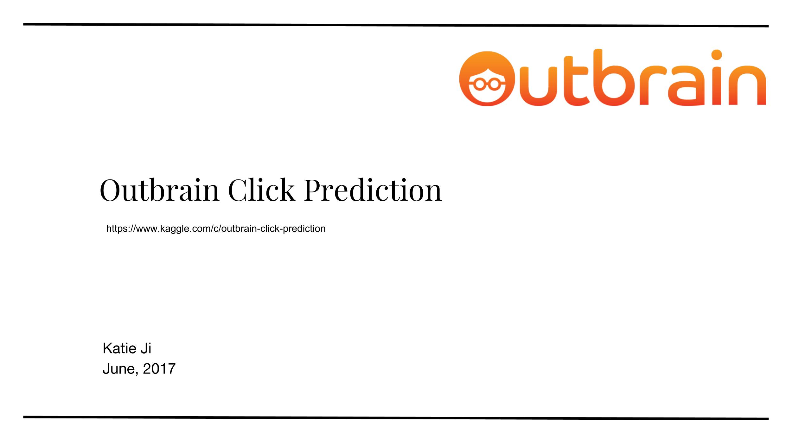
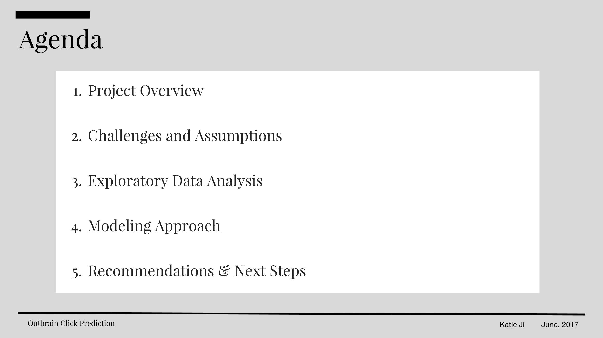
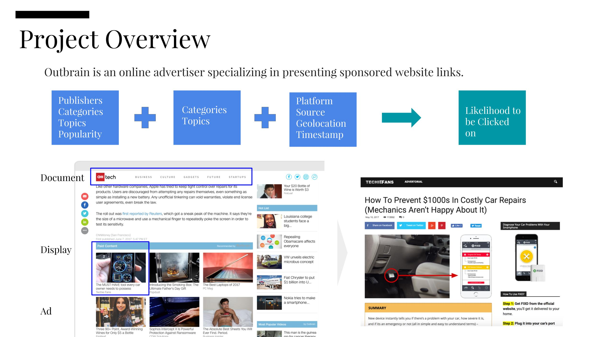
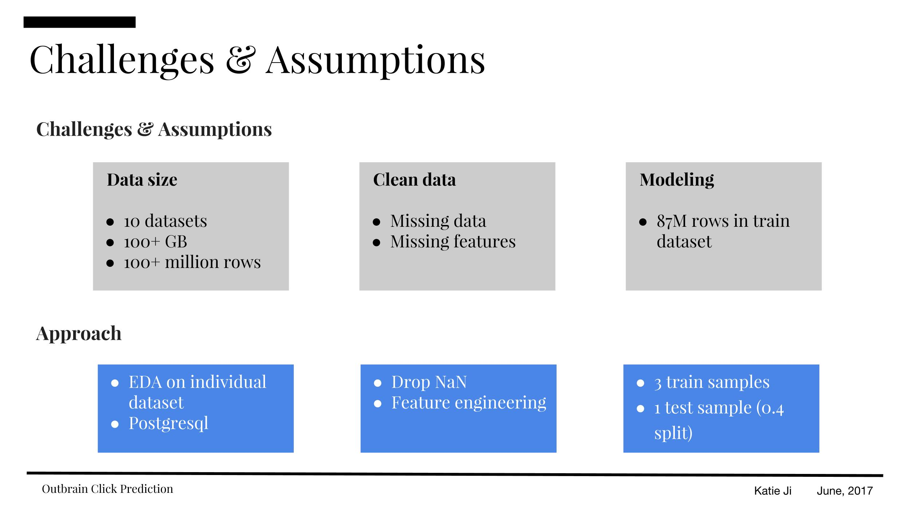
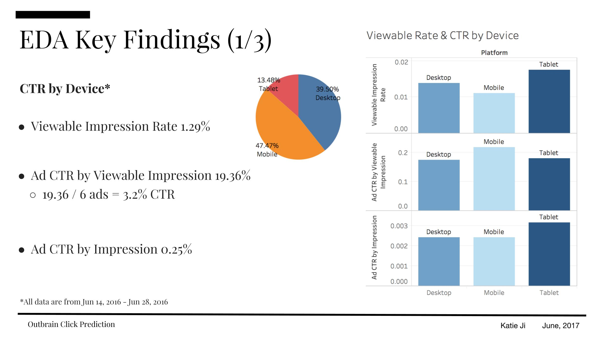
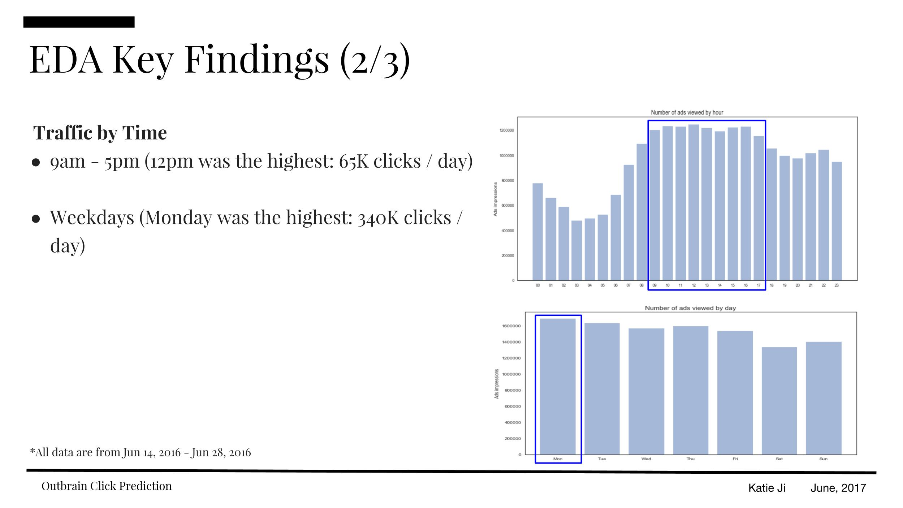
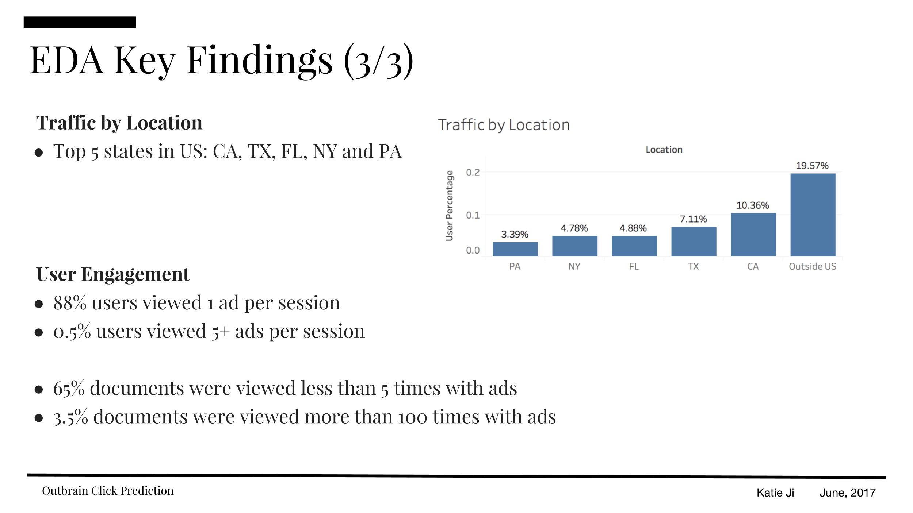
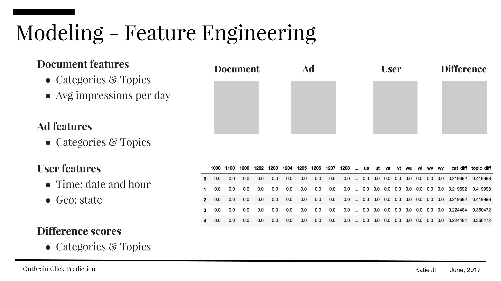
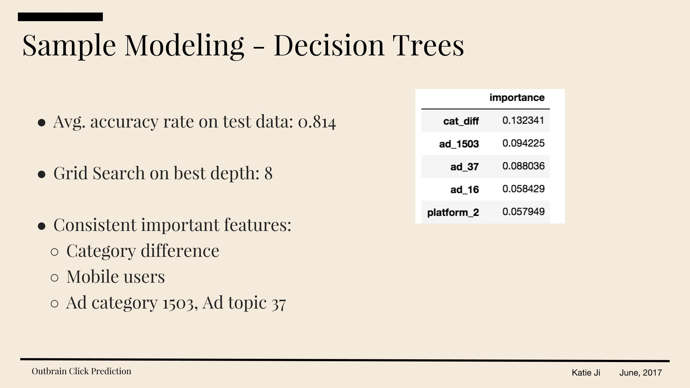
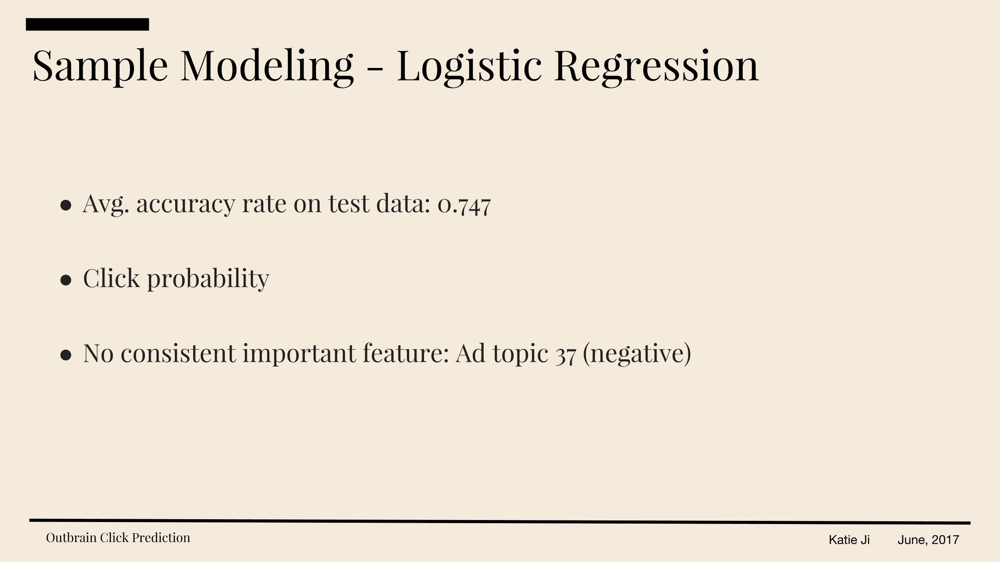
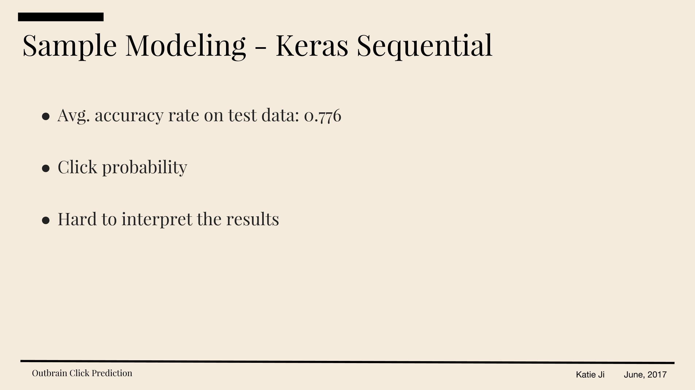
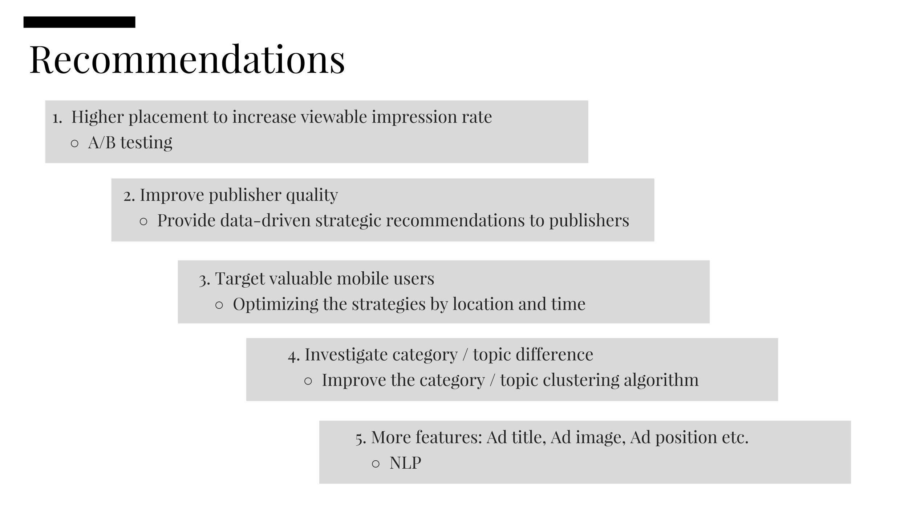
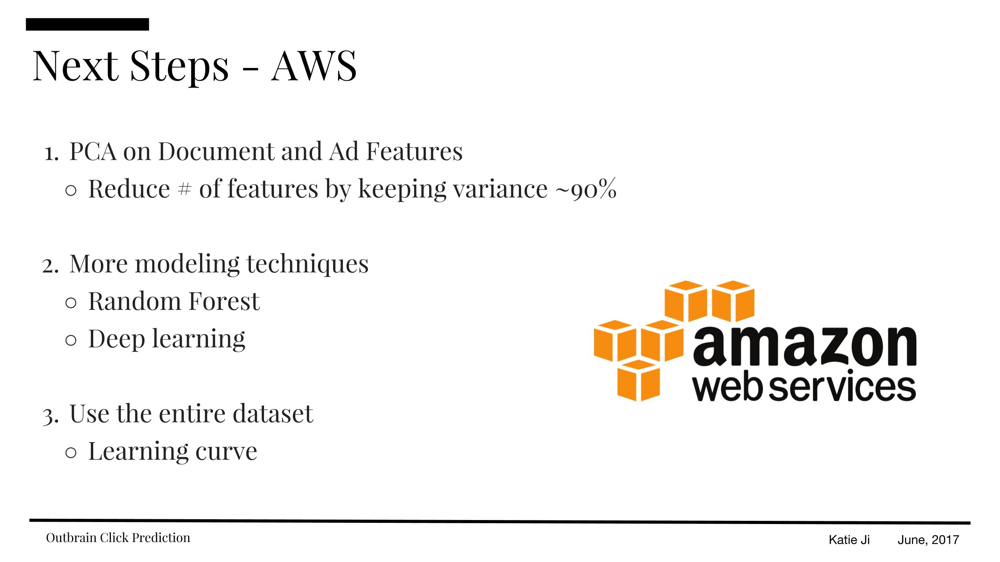
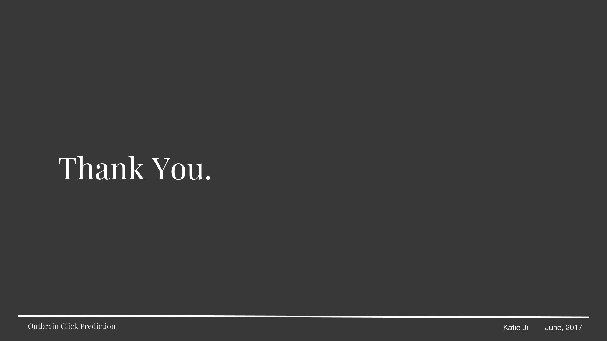