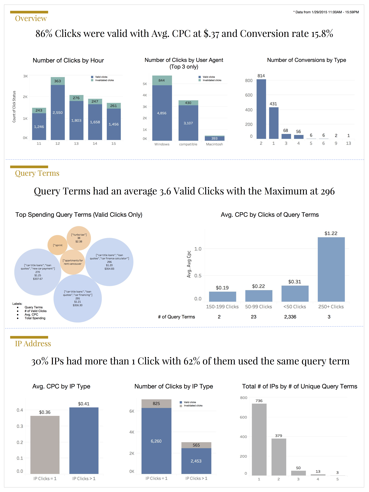

Recently, I did an analysis test for an advertising technology company I applied for. This post shows the notebook of codes and an one-pager of key findings.

I received a dataset that contains ~10,000 rows of user search activities. The columns include click status, timestamp, query term, IP address, cost per click, conversions, user and device. The goal is to come up with high level insights for managers to implement business strategies. Below is an outline of steps I've taken to complete the analysis:

1. Read data
2. Clean data
3. EDA
4. Export the cleaned dataset to Tableau and build charts for One Pager presentation from there

## One Pager 

I built this one-pager with cleaned dataset in Tableau




## 1. Read data
First, I used 'text to column' function in excel to clean up the 'user agent' column. Next I saved it as a csv file, so I can read the data into pandas dataframe


```python
import pandas as pd
import numpy as np

import matplotlib.pyplot as plt
import seaborn as sns
plt.style.use('seaborn-white')
%matplotlib inline
```


```python
df = pd.read_csv('Data-Analyst-Assignment-tab-cleaned.csv')
```


```python
df.head()
```


<div>
<table border="1" class="dataframe">
  <thead>
    <tr style="text-align: right;">
      <th></th>
      <th>click_status</th>
      <th>AMP_timestamp</th>
      <th>Query Term</th>
      <th>IP Address</th>
      <th>Cost Per Click</th>
      <th>Conversions</th>
      <th>User</th>
      <th>Device</th>
    </tr>
  </thead>
  <tbody>
    <tr>
      <th>0</th>
      <td>1</td>
      <td>1/29/15 11:00</td>
      <td>["michael kors","michael michael kors"]</td>
      <td>2.118.171.21</td>
      <td>$ .28</td>
      <td>0</td>
      <td>Mozilla/5.0</td>
      <td>iPad</td>
    </tr>
    <tr>
      <th>1</th>
      <td>1</td>
      <td>1/29/15 11:00</td>
      <td>["meet girls","dating girls"]</td>
      <td>0.82.173.102</td>
      <td>$ .17</td>
      <td>0</td>
      <td>Mozilla/5.0</td>
      <td>Windows</td>
    </tr>
    <tr>
      <th>2</th>
      <td>1</td>
      <td>1/29/15 11:00</td>
      <td>["meet girls","dating girls"]</td>
      <td>0.82.173.102</td>
      <td>$ .17</td>
      <td>0</td>
      <td>Mozilla/5.0</td>
      <td>Windows</td>
    </tr>
    <tr>
      <th>3</th>
      <td>1</td>
      <td>1/29/15 11:00</td>
      <td>["credit report","credit karma","free online c...</td>
      <td>219.32.49.92</td>
      <td>$ .90</td>
      <td>0</td>
      <td>Mozilla/5.0</td>
      <td>Windows</td>
    </tr>
    <tr>
      <th>4</th>
      <td>1</td>
      <td>1/29/15 11:00</td>
      <td>["Byethost"]</td>
      <td>13.54.12.142</td>
      <td>$ .17</td>
      <td>0</td>
      <td>Mozilla/4.0</td>
      <td>compatible</td>
    </tr>
  </tbody>
</table>
</div>


```python
df.info()
```

    <class 'pandas.core.frame.DataFrame'>
    RangeIndex: 10103 entries, 0 to 10102
    Data columns (total 8 columns):
    click_status       10103 non-null int64
    AMP_timestamp      10103 non-null object
    Query Term         10103 non-null object
    IP Address         10103 non-null object
    Cost Per Click     10103 non-null object
    Conversions        10103 non-null int64
    User               10103 non-null object
    Device             10099 non-null object
    dtypes: int64(2), object(6)
    memory usage: 631.5+ KB


## 2. Clean data

Noticed the dataset has 7 columns without missing values. In this section, I am going to clean all columns and create new features for further analysis.

Steps:
1. Check NaN values and column names
2. Clean click_status
3. Clean AMP_timestamp
4. Clean query_terms
5. Clean cost_per_click

#### 1. Double check NaN values and rename column names


```python
# Check missing values - no NaN values
df[df.isnull().any(axis=1)]
```


<div>
<table border="1" class="dataframe">
  <thead>
    <tr style="text-align: right;">
      <th></th>
      <th>click_status</th>
      <th>AMP_timestamp</th>
      <th>Query Term</th>
      <th>IP Address</th>
      <th>Cost Per Click</th>
      <th>Conversions</th>
      <th>User</th>
      <th>Device</th>
    </tr>
  </thead>
  <tbody>
  </tbody>
</table>
</div>


```python
df.columns
```


    Index([u'click_status', u'AMP_timestamp', u'Query Term ', u'IP Address',
           u'Cost Per Click ', u'Conversions', u'User', u'Device'],
          dtype='object')


```python
# rename columns with extra space
df.columns = ['click_status','AMP_timestamp','query_term','IP_address','cost_per_click','conversions','user','device']
```

#### 2. Clean click_status : click_status 1 = valid click, 0 = invalidated click


```python
df.click_status = df.click_status.map(lambda x: 1 if x == 1 else 0)
```

#### 3. Clean AMP_timestamp
- Extract date and hour
- Timestamp ranges from 1/29/15 11:00 - 1/29/15 15:59


```python
df['date'] = df.AMP_timestamp.map(lambda x: x[:7])
df['hour'] = df.AMP_timestamp.map(lambda x: int(x[8:10]))
```


```python
print 'max hour: ', df['hour'].max()
print 'min hour: ', df['hour'].min()
```

    max hour:  15
    min hour:  11


#### 4. Clean Query Term
- 3 query terms related to car loans appeared on the top
- The # of query terms ranges from 1 to 7


```python
df.query_term.value_counts().head(10)
```


    ["car title loans","loan quotes","car financing"]                                  317
    ["car title loans","loan quotes","car finance calculator"]                         313
    ["car title loans","loan quotes","new car payment"]                                290
    ["Byethost"]                                                                       268
    ["edu online info","degree programs","online degree program"]                      176
    ["Naver.com"]                                                                      111
    ["ron"]                                                                            106
    ["apartments for rent vancouver craigslist","craigslist used cars","personals"]     88
    ["force download","youtuby","youtube org"]                                          87
    ["apricot complex"]                                                                 85
    Name: query_term, dtype: int64


```python
# Create a new column that stores query terms as a list
df['query_term_list'] = df.query_term.map(lambda x: x.strip('[').strip(']').replace('"','').split(','))
```


```python
# Create a new column that indicates the length of the query terms list
df['len_query_term_list'] = df['query_term_list'].map(lambda x: len(x))
```


```python
df['len_query_term_list'].value_counts()
```


    3    4908
    1    4016
    2     826
    4     139
    5     122
    6      91
    7       1
    Name: len_query_term_list, dtype: int64


#### 5. Clean cost_per_click and converstions


```python
df.cost_per_click = df.cost_per_click.map(lambda x: float(x.strip('$ ')))
```


```python
df.conversions.value_counts()
```


    0     8719
    2      814
    1      431
    3       68
    4       56
    6        6
    5        6
    9        2
    13       1
    Name: conversions, dtype: int64


## 3. Analysis

#### 1. High level trends
- Valid click rate at 86%
- Avg. CPC for valid clicks at .37
- Total spending for valid clicks 3,287
- Conversion rate 15.8%


```python
df_1 = df[df.click_status == 1]
df_0 = df[df.click_status == 0]
```


```python
# Valid click rate
len(df_1) / float(len(df))
```


    0.8624171038305454


```python
# Avg CPC for valid clicks
df_1.cost_per_click.mean()
```


    0.3773258349592622


```python
# Total spending for valid clicks
df_1.cost_per_click.sum()
```


    3287.6400000000517


```python
# Conversion rate for valid clicks
len(df[df.conversions!=0])/float(len(df_1))
```


    0.1588431079995409


#### 2. For clicks with status = 1:
- Identify the top spending query term and the average cost per click
- Identify the top converting IP addresses


```python
# Identify the top spending query term and the average cost per click
qt_table = pd.pivot_table(df_1,index='query_term',values=['click_status','cost_per_click'],aggfunc=[np.sum]).sort_values(by=('sum','cost_per_click'),ascending=False)
qt_table[('avg','cost_per_click')] = qt_table[('sum','cost_per_click')] / qt_table[('sum','click_status')]
qt_table.head(10)
```


<div>
<table border="1" class="dataframe">
  <thead>
    <tr>
      <th></th>
      <th colspan="2" halign="left">sum</th>
      <th>avg</th>
    </tr>
    <tr>
      <th></th>
      <th>click_status</th>
      <th>cost_per_click</th>
      <th>cost_per_click</th>
    </tr>
    <tr>
      <th>query_term</th>
      <th></th>
      <th></th>
      <th></th>
    </tr>
  </thead>
  <tbody>
    <tr>
      <th>["car title loans","loan quotes","car financing"]</th>
      <td>295</td>
      <td>356.30</td>
      <td>1.207797</td>
    </tr>
    <tr>
      <th>["car title loans","loan quotes","car finance calculator"]</th>
      <td>296</td>
      <td>354.83</td>
      <td>1.198750</td>
    </tr>
    <tr>
      <th>["car title loans","loan quotes","new car payment"]</th>
      <td>270</td>
      <td>337.67</td>
      <td>1.250630</td>
    </tr>
    <tr>
      <th>["apartments for rent vancouver craigslist","craigslist used cars","personals"]</th>
      <td>81</td>
      <td>97.11</td>
      <td>1.198889</td>
    </tr>
    <tr>
      <th>["turbo tax"]</th>
      <td>38</td>
      <td>90.42</td>
      <td>2.379474</td>
    </tr>
    <tr>
      <th>["sprint wireless","sprint mobile","sprint","sprint wireless phones","cell phone","smartphone"]</th>
      <td>27</td>
      <td>61.54</td>
      <td>2.279259</td>
    </tr>
    <tr>
      <th>["edu online info","degree programs","online degree program"]</th>
      <td>174</td>
      <td>38.19</td>
      <td>0.219483</td>
    </tr>
    <tr>
      <th>["autotrader","autotrade","car website"]</th>
      <td>33</td>
      <td>36.04</td>
      <td>1.092121</td>
    </tr>
    <tr>
      <th>["turbo tax","turbotax","intuit turbotax"]</th>
      <td>4</td>
      <td>35.51</td>
      <td>8.877500</td>
    </tr>
    <tr>
      <th>["Byethost"]</th>
      <td>191</td>
      <td>32.47</td>
      <td>0.170000</td>
    </tr>
  </tbody>
</table>
</div>


```python
qt_table.columns = ['valid_clicks','total_spending','avg_cpc']
```


```python
bins = [0, 50, 100, 150, 200,250,300]
group_names = ['<50 Clicks', '50-99 Clicks', '100-149 Clicks', '150-199 Clicks','200-249 Clicks','250+ Clicks']
qt_table['click_bucket'] = pd.cut(qt_table['valid_clicks'], bins, labels=group_names)
```


```python
qt_table.valid_clicks.mean()
```


    3.6857021996615904


```python
# Identify the top converting IP addresses
df_1[df.conversions != 0].IP_address.value_counts().to_frame().head(10)
```

    /Users/KatieJi/anaconda/lib/python2.7/site-packages/ipykernel/__main__.py:2: UserWarning: Boolean Series key will be reindexed to match DataFrame index.
      from ipykernel import kernelapp as app


<div>
<table border="1" class="dataframe">
  <thead>
    <tr style="text-align: right;">
      <th></th>
      <th>IP_address</th>
    </tr>
  </thead>
  <tbody>
    <tr>
      <th>99.58.152.185</th>
      <td>5</td>
    </tr>
    <tr>
      <th>254.48.209.110</th>
      <td>5</td>
    </tr>
    <tr>
      <th>40.42.200.39</th>
      <td>4</td>
    </tr>
    <tr>
      <th>1.83.232.46</th>
      <td>4</td>
    </tr>
    <tr>
      <th>221.20.148.233</th>
      <td>4</td>
    </tr>
    <tr>
      <th>173.145.41.71</th>
      <td>4</td>
    </tr>
    <tr>
      <th>214.170.202.50</th>
      <td>3</td>
    </tr>
    <tr>
      <th>217.149.200.112</th>
      <td>3</td>
    </tr>
    <tr>
      <th>254.48.190.183</th>
      <td>3</td>
    </tr>
    <tr>
      <th>226.58.131.249</th>
      <td>3</td>
    </tr>
  </tbody>
</table>
</div>


```python
# Query terms table
fig,ax = plt.subplots(figsize=(12, 7))
sns.barplot(x = qt_table.head(20).index, y = qt_table.head(20)['sum'])
plt.ylabel('Total occurences')
plt.title('Top 20 Query Terms Occurences', fontsize=14);

total_num = float(len(qt_table))
for i in [1,5,10, 50, 100, 200]:
    print '-- {:.2f}% of query terms had {} or more valid clicks'.format( (qt_table['sum'][qt_table['sum']>=i].count()) / total_num *100,i)
```

    -- 91.38% of query terms had 1 or more valid clicks
    -- 11.44% of query terms had 5 or more valid clicks
    -- 5.37% of query terms had 10 or more valid clicks
    -- 1.16% of query terms had 50 or more valid clicks
    -- 0.19% of query terms had 100 or more valid clicks
    -- 0.12% of query terms had 200 or more valid clicks


#### 3. For IP addresses with > 1 click:
- Provide a breakdown on invalid and valid clicks. Include steps taken to conduct analysis
- Provide a breakdown on whether these users send the same query term for each click. Include steps taken to conduct analysis
- Identify any shared attributes for this pool of users (if any). Include steps taken to conduct analysis


```python
ip_list = df.IP_address.value_counts()[df.IP_address.value_counts() >1].to_frame().index
```


```python
df_ip = df[df.IP_address.isin(ip_list)]
```


```python
# Provide a breakdown on invalid and valid clicks. Include steps taken to conduct analysis
ip_status_table = df_ip.click_status.value_counts().to_frame()
ip_status_table['percentage'] = ip_status_table.click_status / ip_status_table.click_status.sum()
ip_status_table
```


<div>
<table border="1" class="dataframe">
  <thead>
    <tr style="text-align: right;">
      <th></th>
      <th>click_status</th>
      <th>percentage</th>
    </tr>
  </thead>
  <tbody>
    <tr>
      <th>1</th>
      <td>2453</td>
      <td>0.81279</td>
    </tr>
    <tr>
      <th>0</th>
      <td>565</td>
      <td>0.18721</td>
    </tr>
  </tbody>
</table>
</div>


```python
# Provide a breakdown on whether these users send the same query term for each click
ip_query_table = pd.pivot_table(df_ip,index=['IP_address','query_term'],values='click_status',aggfunc=[len]).reset_index()
ip_query_table.head()
```


<div>
<table border="1" class="dataframe">
  <thead>
    <tr style="text-align: right;">
      <th></th>
      <th>IP_address</th>
      <th>query_term</th>
      <th>len</th>
    </tr>
  </thead>
  <tbody>
    <tr>
      <th>0</th>
      <td>0.38.12.224</td>
      <td>["youtube","youtuby","r youtube"]</td>
      <td>1</td>
    </tr>
    <tr>
      <th>1</th>
      <td>0.38.12.224</td>
      <td>["youtube","youtuby","youtube org"]</td>
      <td>2</td>
    </tr>
    <tr>
      <th>2</th>
      <td>0.53.181.217</td>
      <td>["Nyanko Seek"]</td>
      <td>3</td>
    </tr>
    <tr>
      <th>3</th>
      <td>0.71.103.209</td>
      <td>["meet girls","dating girls"]</td>
      <td>4</td>
    </tr>
    <tr>
      <th>4</th>
      <td>0.73.240.6</td>
      <td>["Badidu"]</td>
      <td>2</td>
    </tr>
  </tbody>
</table>
</div>


```python
ip_query_table_2 = pd.pivot_table(ip_query_table,index=['IP_address'],values='query_term',aggfunc=[len]).reset_index()
ip_query_table_2.columns = ['IP_address','unique_query_terms']
```


```python
ip_unique_query = ip_query_table_2.unique_query_terms.value_counts().to_frame()
ip_unique_query['percentage'] = ip_unique_query.unique_query_terms / ip_unique_query.unique_query_terms.sum()
ip_unique_query
```


<div>
<table border="1" class="dataframe">
  <thead>
    <tr style="text-align: right;">
      <th></th>
      <th>unique_query_terms</th>
      <th>percentage</th>
    </tr>
  </thead>
  <tbody>
    <tr>
      <th>1</th>
      <td>736</td>
      <td>0.623201</td>
    </tr>
    <tr>
      <th>2</th>
      <td>379</td>
      <td>0.320914</td>
    </tr>
    <tr>
      <th>3</th>
      <td>50</td>
      <td>0.042337</td>
    </tr>
    <tr>
      <th>4</th>
      <td>13</td>
      <td>0.011008</td>
    </tr>
    <tr>
      <th>5</th>
      <td>3</td>
      <td>0.002540</td>
    </tr>
  </tbody>
</table>
</div>


```python
# Identify any shared attributes for this pool of users (if any)
# Create ip_clicks_status: 1 = IP addresses with > 1 click, 0 = IP addresses with 1 click
df['ip_clicks_status'] = df.IP_address.map(lambda x: 1 if x in ip_list else 0)
```


```python
df['ip_clicks_status'].sum() / float(len(df['ip_clicks_status']))
```


    0.2987231515391468


```python
df.to_csv('cleaned_data.csv')
```
